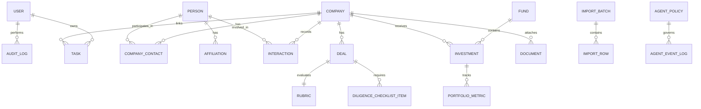
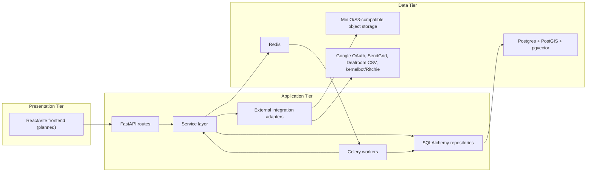
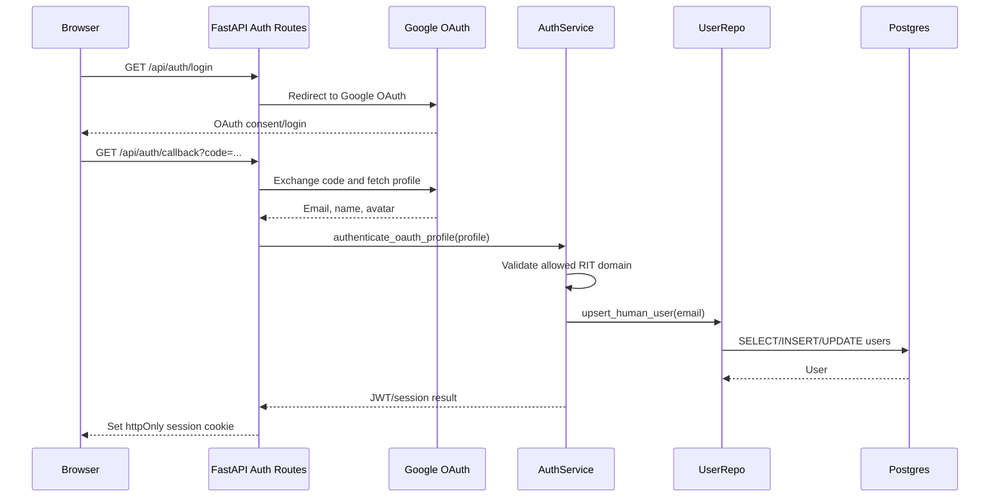
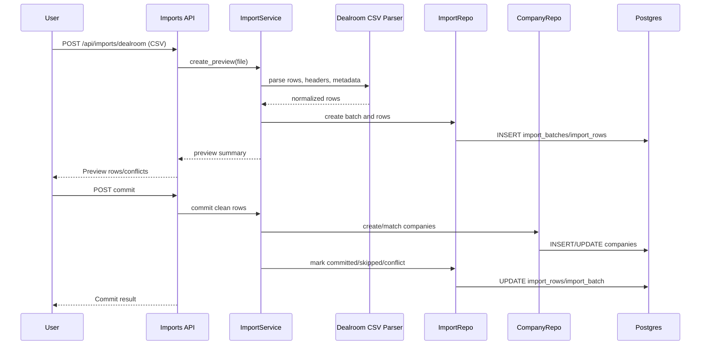
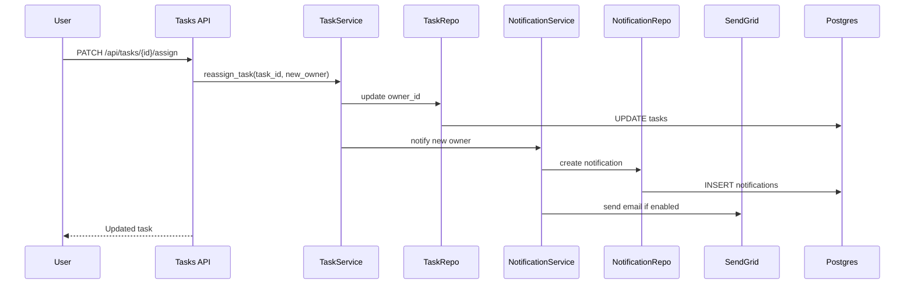
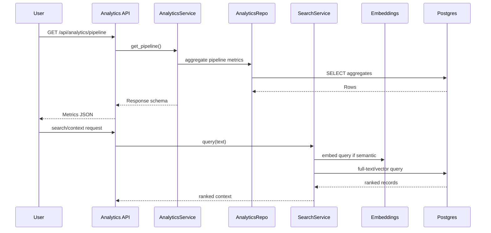
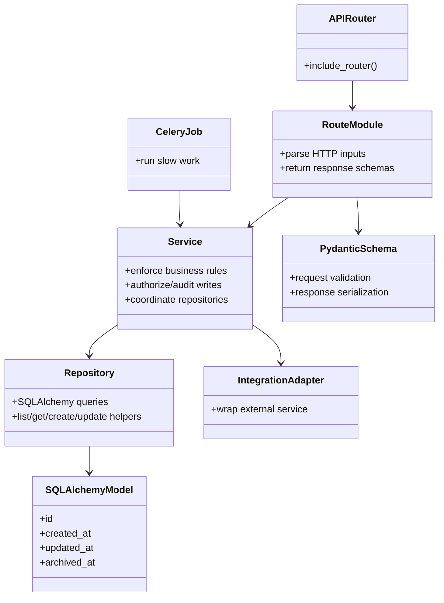

# 1829 Ventures CRM Design Documentation

## Team Information

- Project: 1829 Ventures CRM
- Team/owner: 1829 Ventures
- Implementation contributors:
  - Shane Girolamo
  - Claude/Codex/Gemini-assisted implementation agents
- Current implementation branch: `v1`
- Last updated: 2026-06-14

## Executive Summary

1829 Ventures CRM is an internal operating system for managing alumni founder
relationships, deal flow, diligence, portfolio tracking, tasks, documents,
Dealroom imports, analytics, and Ritchie, a persistent AI agent. The CRM is
company-centered: a company record is the primary workspace and connects to
people, affiliations, contacts, interactions, deals, diligence artifacts,
documents, tasks, investments, portfolio metrics, imports, audit history, and
AI activity.

The current implementation is backend-first. The backend uses FastAPI,
SQLAlchemy, Postgres/PostGIS/pgvector, Redis, Celery, MinIO-compatible storage,
Google OAuth, SendGrid integration boundaries, full-text search, semantic search,
and a strict service/repository architecture. The frontend has not yet been
implemented; it is planned as a React/Vite TypeScript application generated
against the FastAPI OpenAPI contract.

### Purpose

The purpose of the system is to give the 1829 Ventures team one reliable,
auditable workspace for tracking RIT-connected founders and companies from early
relationship development through investment review, diligence, investment, and
portfolio monitoring. The product is designed for internal team use in v1:
managing directors, principals, analysts, and team members all share the same
human-user access model.

### Current Status

Backend Agents 01 through 08 are implemented and merged into `v1`:

- Backend foundation.
- Models, schemas, and migrations.
- Auth, users, and permissions.
- Core CRM API.
- Pipeline and diligence.
- Dealroom import.
- Documents, tasks, and notifications.
- Search and analytics.

Remaining backend implementation before frontend:

- Fix Alembic multiple heads created by parallel Agent 07/08 migrations.
- Agent 09: Gmail ingestion.
- Agent 10: Ritchie agent integration.
- Agent 11: backend review and hardening.

Frontend implementation begins after backend contracts are stable:

- Agent 20: frontend foundation.
- Agents 21 and 22: CRM workflows and imports/agent/portfolio workflows.
- Agent 23: polish.

### Glossary and Acronyms

| Term | Definition |
| --- | --- |
| CRM | Customer relationship management system; here, an internal operating system for 1829 Ventures company, founder, pipeline, and portfolio workflows. |
| RIT | Rochester Institute of Technology. 1829's v1 authentication and thesis focus are tied to RIT accounts and ecosystem connections. |
| Ritchie | The AI agent that interacts with the CRM through typed, audited API/MCP surfaces. |
| Dealroom | External data source used to import startup/company ecosystem data from CSV exports. |
| Diligence | Investment review work performed on a deal, including checklist items and the 1829 screening rubric. |
| Rubric | 1829's screening scorecard with knockout gates and weighted sub-scores. |
| Pipeline | The relationship and investment workflow states used to track companies and deals. |
| PostGIS | Postgres extension for geospatial data and queries. |
| pgvector | Postgres extension for vector embeddings and semantic search. |
| MCP | Model Context Protocol. The planned Ritchie integration uses Streamable HTTP MCP. |
| API Layer | FastAPI routes responsible for HTTP input/output only. |
| Service Layer | Business logic, permissions, audit, workflow, and source-of-truth enforcement. |
| Repository Layer | SQLAlchemy query isolation. |
| Data Tier | Postgres, PostGIS, pgvector, Redis, and S3-compatible object storage. |
| Soft delete | Archival using `archived_at` instead of hard deletion. |
| Actor | The entity that performs a write: human, import, system, or agent. |
| Binary policy | Ritchie governance model where each tool/field is either `authorized` or `blocked`; no proposal/approval queue exists in v1. |

## Requirements

### Definition of MVP

The v1 MVP is an internal backend-first CRM that can support 1829 Ventures'
core company, founder, pipeline, diligence, import, document, task, analytics,
and AI-agent workflows through stable API contracts. The frontend is planned but
not yet implemented.

MVP capabilities:

- Google OAuth login for eligible RIT Google accounts.
- User records and role metadata for future permission expansion.
- Equal human-user access in v1.
- Company, people, contact, affiliation, interaction, document, fund,
  investment, portfolio metric, tag, and task data modeling.
- Core CRM CRUD APIs and services.
- Audit logging for create/update/archive operations.
- Soft deletion for core entities.
- Separate relationship and investment pipeline states.
- Review-needed triage into start-review, monitor, or pass.
- Deal diligence checklist and screening rubric scoring.
- Dealroom CSV upload, parsing, preview, dedupe, conflict review, and partial
  commit.
- Document metadata and S3-compatible storage boundary.
- Tasks, assignments, reminders, notifications, and daily digest jobs.
- Full-text and semantic search infrastructure.
- Analytics APIs for pipeline, portfolio, source, sector, interaction cadence,
  thesis fit, and agent activity.
- Ritchie-ready authentication and data surfaces, with full Ritchie tool
  execution still pending.

### MVP Features

- Auth and users.
- Core CRM records.
- Deal pipeline.
- Diligence and rubric.
- Dealroom import.
- Documents and storage.
- Tasks and notifications.
- Search and analytics.
- Audit and governance foundations.
- Worker-based background processing.

### Enhancements Planned Beyond Current Implementation

- Gmail forwarded-email ingestion.
- CRM-side Ritchie tools, policy gate, MCP endpoint, context retrieval, event
  fanout, idempotency, and AI audit.
- Backend hardening pass after Ritchie and Gmail are implemented.
- React/Vite frontend app shell and workflows.
- Generated frontend domain types from FastAPI OpenAPI.
- Production deployment hardening.

## Application Domain

The CRM domain is centered on companies. Companies link to people, contacts,
affiliations, interactions, deals, documents, tasks, imports, search embeddings,
audit events, and portfolio activity.



Important domain entities:

- `User`: human team members and Ritchie's scoped agent identity.
- `Company`: core company profile and workspace.
- `Person`: founders, alumni, LP contacts, advisors, faculty experts, and
  co-investors.
- `Affiliation`: RIT relationship and ecosystem metadata for people.
- `CompanyContact`: company-person join with primary-contact support.
- `Interaction`: emails, calls, meetings, notes, introductions, and diligence
  touchpoints.
- `Deal`: investment opportunities for a company.
- `Rubric`: diligence scorecard for a deal.
- `DiligenceChecklistItem`: evidence/checklist work for a deal.
- `Fund`: investment vehicle such as Beta or Fund I.
- `Investment`: investment record linking fund, company, and optionally deal.
- `PortfolioMetric`: operating and valuation snapshots.
- `Document`: document metadata, storage keys, and entity links.
- `Task`: follow-ups, assignments, reminders, diligence work, and queues.
- `Notification`: in-app/email notification records.
- `ImportBatch` and `ImportRow`: Dealroom import workflow records.
- `AuditLog`, `AiAuditLog`, `AgentEventLog`, `AgentPolicy`: governance and
  Ritchie audit model.

## Architecture and Design

### Summary

The intended runtime architecture is a three-tier web architecture:



The backend is intentionally layered:

- Routes parse HTTP input and return HTTP output.
- Services enforce business rules, permissions, audit, workflow transitions,
  and source-of-truth rules.
- Repositories isolate SQLAlchemy queries.
- Integrations wrap external systems.
- Workers handle slow or asynchronous jobs.

### Overview of User Interface

No frontend has been implemented yet. The planned frontend is a React/Vite
TypeScript single-page application with:

- App shell and sidebar.
- Google OAuth/session handling.
- Company-centered workspace.
- Company, people, deal, diligence, document, task, import, analytics, and
  Ritchie views.
- TanStack Query API integration.
- Generated OpenAPI domain types.

Planned high-level navigation:

```text
Login -> App Shell
  -> Companies
     -> Company Detail
        -> Profile
        -> People/contacts
        -> Interactions
        -> Deals/diligence/rubric
        -> Documents
        -> Tasks
        -> Audit/activity
  -> Deal Pipeline
  -> Imports
  -> Tasks
  -> Documents
  -> Portfolio
  -> Analytics
  -> Ritchie/Agent Activity
```

The frontend should not hand-write domain model types. It must generate
TypeScript types from FastAPI OpenAPI using `openapi-typescript`.

### Presentation Tier

The presentation tier is planned but not implemented. It will be responsible for
user interaction, route navigation, data fetching, form validation, and rendering
CRM workflows. It should not encode backend business rules that belong in
services.

Planned frontend technologies:

- React.
- Vite.
- TypeScript.
- React Router.
- TanStack Query.
- shadcn/ui.
- Tailwind CSS.
- React Hook Form and Zod for form validation.
- OpenAPI-generated domain types.

Expected component categories:

- Layout components: app shell, sidebar, top nav, protected route wrapper.
- Data components: tables, timelines, detail panels, filter controls.
- Workflow components: triage actions, rubric editor, import preview, task
  reassignment, document upload.
- API hooks: query/mutation wrappers around generated request/response types.

### Application Tier

The application tier is the implemented FastAPI backend plus Celery worker
system.

#### API Layer

The API layer is implemented with FastAPI routers. Route handlers are thin and
delegate to services.

Primary routers currently registered in `backend/app/api/router.py`:

- `health`
- `auth`
- `users`
- `companies`
- `people`
- `company-contacts`
- `affiliations`
- `interactions`
- `deals`
- `deal-statuses`
- `imports`
- `funds`
- `investments`
- `portfolio-metrics`
- `documents`
- `tasks`
- `analytics`

Pending routers:

- `email` for Gmail ingestion.
- `agent` for Ritchie.

Representative API responsibilities:

- Authentication and current-user lookup.
- CRUD and archive endpoints for CRM entities.
- Pipeline actions and diligence/rubric operations.
- Dealroom upload/preview/commit.
- Task assignment/completion.
- Document metadata and upload URL workflows.
- Analytics and search-facing outputs.

#### Service Layer

The service layer owns business logic.

Implemented service modules:

- `auth_service.py`: OAuth profile handling, JWT issue/verification, agent key
  auth.
- `permission_service.py`: v1 permission guard.
- `audit_service.py`: audit log creation and actor context helpers.
- `company_service.py`: company CRUD, archive, completeness.
- `people_service.py`: people, contacts, affiliations.
- `interaction_service.py`: interactions.
- `investment_service.py`: funds, investments, portfolio metrics.
- `document_service.py`: document metadata and upload boundary.
- `deal_service.py`: deal CRUD.
- `pipeline_service.py`: review-needed triage and status transitions.
- `diligence_service.py`: rubric and checklist logic.
- `dealroom_import_service.py`: import preview and commit.
- `task_service.py`: task creation, assignment, reassignment, completion.
- `notification_service.py`: notification records, SendGrid dispatch boundary,
  digest selection.
- `search_service.py`: keyword and semantic search.
- `analytics_service.py`: analytics aggregation API.

Pending service modules:

- `gmail_ingestion_service.py`.
- `agent_service.py`.
- `agent_policy_service.py`.

#### Repository Layer

Repositories isolate SQLAlchemy queries from business logic.

Implemented repositories:

- `base.py`
- `users.py`
- `companies.py`
- `people.py`
- `interactions.py`
- `investments.py`
- `documents.py`
- `deals.py`
- `deal_statuses.py`
- `imports.py`
- `tasks.py`
- `notifications.py`
- `analytics.py`

Pending repositories:

- `agent.py`.
- Gmail may extend `interactions.py` or add email-specific helpers if needed.

#### Worker Layer

Celery workers process asynchronous jobs. Current job modules registered in
`backend/app/workers/celery_app.py` include:

- `dealroom_import_jobs`
- `notification_jobs`
- `embedding_jobs`
- `analytics_jobs`

Pending workers:

- `gmail_jobs`
- `agent_jobs`

Workers should use the sync SQLAlchemy session/engine, not the async API engine.

#### Integration Layer

Integration adapters wrap external systems and keep services testable.

Implemented integrations:

- `google_oauth.py`: Google OAuth via Authlib.
- `dealroom_csv.py`: Dealroom CSV parsing.
- `storage.py`: S3-compatible storage protocol.
- `minio_storage.py`: local MinIO adapter.
- `sendgrid.py`: SendGrid email adapter.
- `embeddings.py`: lazy sentence-transformer embedding wrapper.

Pending integrations:

- `ritchie_client.py` for kernelbot/Ritchie event fanout.
- Gmail notification ingestion is handled by API/service logic, not Gmail IMAP.

### Data Tier

The data tier consists of Postgres with extensions, Redis, and S3-compatible
object storage.

#### Postgres/PostGIS/pgvector

Postgres is the canonical data store. Extensions:

- PostGIS for geospatial company location data.
- pgvector for semantic search embeddings.

Core tables include:

- `users`
- `companies`
- `people`
- `affiliations`
- `company_contacts`
- `interactions`
- `deals`
- `rubrics`
- `diligence_checklist_items`
- `deal_statuses`
- `funds`
- `investments`
- `portfolio_metrics`
- `documents`
- `tasks`
- `tags`
- `import_batches`
- `import_rows`
- `audit_logs`
- `ai_audit_logs`
- `agent_event_logs`
- `agent_policies`
- `notifications`

#### Redis

Redis is used by Celery as broker/result backend and by API middleware for
rate-limiting.

#### Object Storage

Documents and attachments are stored outside Postgres. Metadata stays in
Postgres. Local development uses MinIO through the S3-compatible storage
adapter.

### Sequence Diagrams

#### OAuth Login And Session Flow



#### Dealroom Import Preview And Commit



#### Task Reassignment And Notification



#### Search And Analytics Query



## Static Module Model

The backend codebase is organized by responsibility rather than by one large
framework-level CRUD abstraction.



## Design Principles

### Separation of Concerns

The project enforces a route/service/repository split. Routes remain thin and
HTTP-specific. Services own rules and coordination. Repositories own SQLAlchemy
query details. This keeps business behavior testable without requiring HTTP
tests for every rule.

### Encapsulation

Persistence and external systems are hidden behind repositories and integration
adapters. For example, services call storage and SendGrid through local adapter
interfaces rather than embedding vendor-specific logic in route handlers.

### Single Source of Truth

Manual CRM fields are treated as authoritative. Imported or AI-derived data is
tracked with provenance and review flags, and Ritchie cannot overwrite
human-curated fields unless a runtime policy explicitly authorizes the relevant
tool/field.

### Auditability

Writes are designed to capture actor, timestamp, old value, new value, and
context. Human, system, import, and agent operations share the audit expectation.
Ritchie-specific audit paths are intentionally separate from human audit logs.

### Soft Deletion

Core CRM data is archived with `archived_at` instead of hard-deleted. This keeps
foreign keys, import provenance, and audit history intact.

### Runtime Configurability

Deal statuses and Ritchie policy are database-backed concepts. The system should
not require redeploying code to adjust pipeline labels or Ritchie authorization
policy.

### Background Work Isolation

Slow operations such as imports, embedding generation, notification digests,
Gmail processing, analytics refreshes, and Ritchie event fanout are delegated to
Celery workers. User-facing request handlers should remain responsive.

### Least Privilege For Agent Access

Ritchie authenticates with a scoped API key and should only access `/agent/*`
and MCP-facing surfaces. Human routes reject agent keys.

## Security Design

- Human login uses Google OAuth.
- v1 accepts eligible RIT Google domains, especially `@g.rit.edu`.
- Sessions use JWTs stored in httpOnly cookies.
- User roles exist for future permission expansion, but v1 grants all active
  human users equal access.
- Ritchie uses a long-lived scoped API key, hashed at rest.
- Agent credentials are rejected from ordinary human routes.
- API rate limits use Redis token buckets.
- Secrets are environment-driven and documented in `.env.example`.

## Data Governance And Audit

Write governance rules:

- Every create/update/archive path should produce audit history.
- Core entities use soft archival.
- Imported fields preserve raw source and field-level provenance.
- Dealroom-imported companies start as `imported_unreviewed`.
- Ritchie policy is binary: authorized or blocked.
- Blocked Ritchie calls never write.
- Authorized Ritchie writes must be idempotent and audited.

## Current Technical Debt And Risks

### Alembic Multiple Heads

Agents 07 and 08 added migrations in parallel, so Alembic currently has two
heads:

```text
7a8f1b2c3d4e
8f3c2b71e4a9
```

This should be fixed before deployment or Agent 11 hardening by adding an
Alembic merge migration or linearizing the migration chain.

### Frontend Not Yet Implemented

There is currently no `frontend/` directory. Any UI-related descriptions in this
document are planned architecture, not implemented behavior.

### Gmail And Ritchie Pending

Gmail ingestion and the full Ritchie integration are not implemented yet. Models
and supporting services exist, but the actual route/service/worker flows remain
future work.

### README Drift

The README still contains some older planning phrasing, including Ritchie
"approval-required proposals." The current plan is strict binary
authorized/blocked policy with no proposal/approval workflow.

## Testing And Verification

Backend verification commands:

```bash
cd backend
.venv/bin/ruff check .
.venv/bin/ruff format --check app tests scripts
DEBUG=false .venv/bin/mypy
DEBUG=false .venv/bin/python -m pytest -q
```

Most recent integrated results:

```text
ruff check: passed
ruff format --check: passed
mypy: passed
full pytest: 62 passed
```

Operational caveat:

```text
Use DEBUG=false in local commands if the shell has DEBUG=release.
```

## Deployment And Runtime Environment

Local development services:

- Postgres/PostGIS/pgvector.
- Redis.
- MinIO.
- FastAPI API.
- Celery worker.

Docker Compose starts supporting services:

```bash
docker compose up -d postgres redis minio
```

Postgres image is built from `docker/postgres/Dockerfile` to include pgvector.

## Future Implementation Plan

1. Fix Alembic multiple heads.
2. Agent 09: Gmail ingestion.
3. Agent 10: Ritchie agent integration.
4. Agent 11: backend review and hardening.
5. Agent 20: frontend foundation.
6. Agents 21 and 22: frontend CRM workflows and imports/agent/portfolio.
7. Agent 23: frontend polish.

Frontend work should begin only after backend API contracts are stable or a
mocked contract is deliberately documented.
