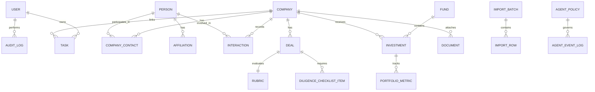
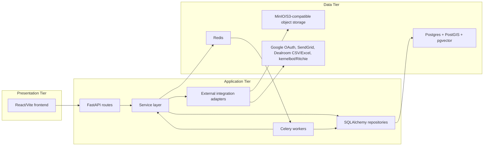
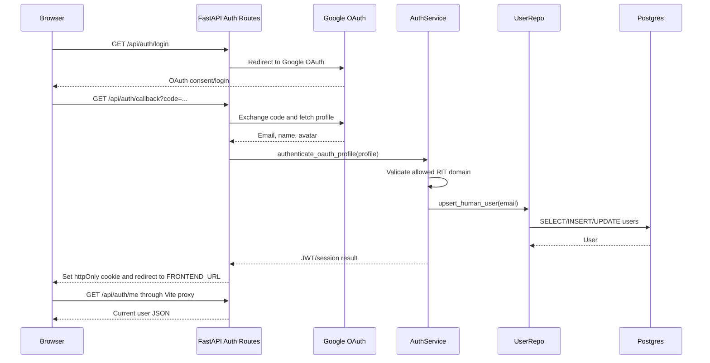
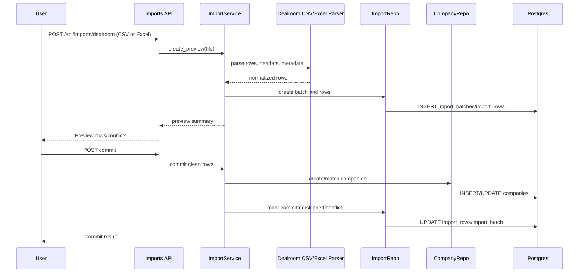
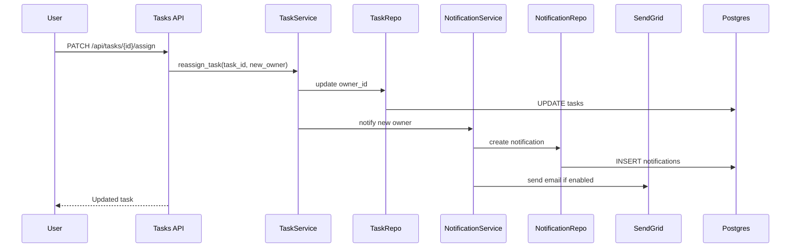
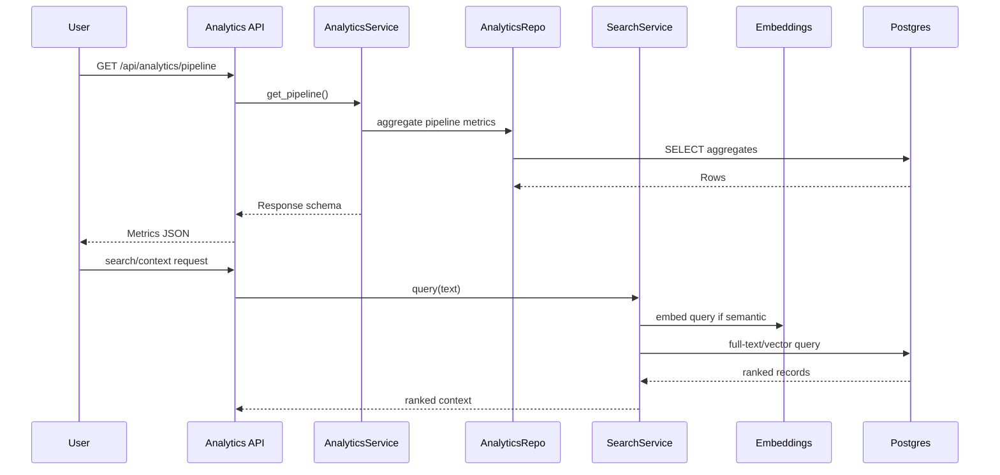
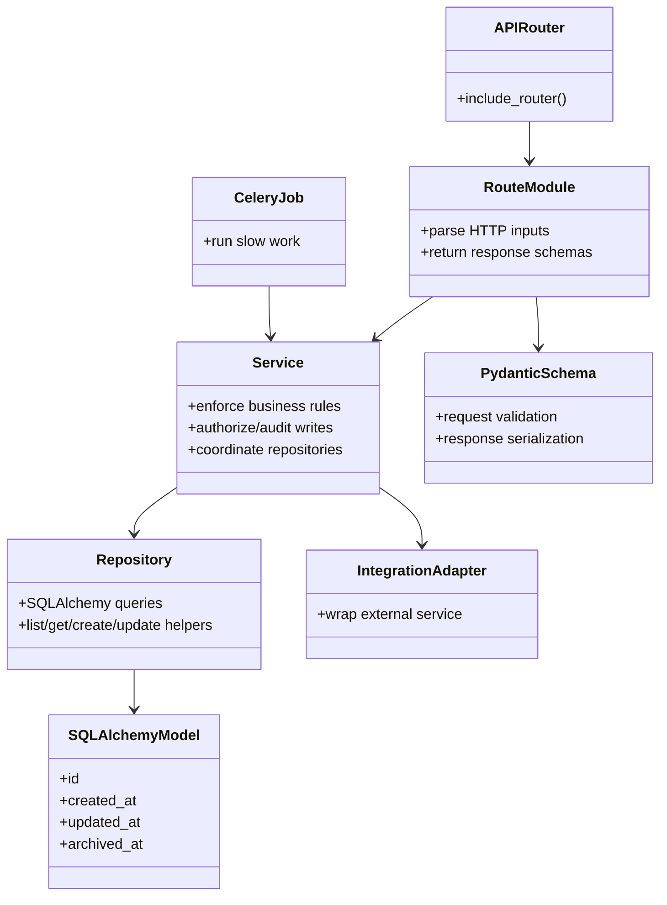

# 1829 Ventures CRM Design Documentation

## Team Information

- Project: 1829 Ventures CRM
- Team/owner: 1829 Ventures
- Implementation contributors:
  - Shane Girolamo
  - Claude/Codex/Gemini-assisted implementation agents
- Current implementation branch: `v1.1`
- Last updated: 2026-06-15

## Executive Summary

1829 Ventures CRM is an internal operating system for managing alumni founder
relationships, deal flow, diligence, portfolio tracking, tasks, documents,
Dealroom imports, analytics, and Ritchie, a persistent AI agent. The CRM is
company-centered: a company record is the primary workspace and connects to
people, affiliations, contacts, interactions, deals, diligence artifacts,
documents, tasks, investments, portfolio metrics, imports, audit history, and
AI activity.

The current implementation includes both backend and frontend surfaces. The
backend uses FastAPI, SQLAlchemy, Postgres/PostGIS/pgvector, Redis, Celery,
MinIO-compatible storage, Google OAuth, SendGrid integration boundaries,
full-text search, semantic search, Gmail ingestion plumbing, and Ritchie agent
policy/activity surfaces. The frontend is a React/Vite TypeScript single-page
application with protected routing, CRM workflow pages, import management,
portfolio views, Ritchie activity/policy screens, and OpenAPI-generated domain
types.

### Purpose

The purpose of the system is to give the 1829 Ventures team one reliable,
auditable workspace for tracking RIT-connected founders and companies from early
relationship development through investment review, diligence, investment, and
portfolio monitoring. The product is designed for internal team use in v1:
managing directors, principals, analysts, and team members all share the same
human-user access model.

### Current Status

Backend Agents 01 through 11 and frontend Agents 20 through 23 have been
implemented and merged into the v1 line:

- Backend foundation.
- Models, schemas, and migrations.
- Auth, users, and permissions.
- Core CRM API.
- Pipeline and diligence.
- Dealroom import.
- Documents, tasks, and notifications.
- Search and analytics.
- Gmail ingestion and fuzzy company matching.
- Ritchie agent integration and runtime authorization policy.
- Backend review and hardening.
- Frontend foundation.
- CRM workflows: companies, people, pipeline, tasks, details, and rubric.
- Imports, Ritchie activity/policy, and portfolio workflows.
- Frontend responsiveness, loading/error/empty states, and build/test polish.

Recent operational fixes:

- `email-validator` was added to backend dependencies because Pydantic
  `EmailStr` requires it.
- Google OAuth callback now sets the httpOnly session cookie and redirects to
  `FRONTEND_URL` instead of returning raw user JSON.
- `FRONTEND_URL` is an environment-driven setting, defaulting locally to
  `http://localhost:5173`.
- Local admin setup/run instructions were expanded in `README.md`.
- `Makefile` now includes setup, Docker, frontend, backend, verification, and
  recovery shortcuts.
- Alembic parallel heads were merged by revision `38f12c67c5ce`.
- Dealroom import now accepts CSV and Excel (`.xlsx`/`.xlsm`) exports, with the
  full column set centralized in `app/integrations/dealroom_columns.py` and a
  downloadable column template (`GET /api/imports/dealroom/template`).
- The Dealroom import service refreshes the import batch after commit so its
  server-side `updated_at` is loaded before serialization (previously this raised
  a `MissingGreenlet` error in the upload/commit responses).
- A startup migration guard (`scripts/check_migration_state.py`) auto-recovers the
  "Alembic stamped but tables missing" state on container start and `make migrate`.
- The import rows endpoint (`GET /api/imports/{batch_id}/rows`) now returns a
  `PaginatedResponse[ImportRowRead]`, matching the app's list-response convention
  and the frontend's expected page shape.
- Integration tests now run against a dedicated, auto-created `<db>_test` database
  (e.g. `crm_test`) instead of the application database. The fixtures drop and
  recreate the whole schema, so running them against the dev database previously
  wiped local data; they are now isolated from it.
- Founder-contact creation during commit now dedupes within a company, so a row
  that lists the same founder twice no longer violates the `uq_company_person`
  constraint and aborts the whole import.
- Uncommitted import batches are discarded when the Import Manager page loads
  (`DELETE /api/imports/uncommitted`), so forgotten staging data (batch + preview
  rows) does not accumulate. Committed and partially-committed batches are kept.
- The company list endpoint (`GET /api/companies`) accepts a `q` parameter that
  filters by name, domain, or website (case-insensitive); the companies page uses
  it for search and loads results via infinite scroll instead of a fixed page.
- Company search is now hybrid, merged in priority order: (1) exact/substring
  matches on name/domain/website (ILIKE), (2) full-text matches on
  name/description/thesis notes (tsvector) so query words in the description match
  even when the name doesn't (e.g. "dog" finds a company described as dog
  training), and (3) semantically similar companies via pgvector, bounded by
  `SEARCH_SEMANTIC_LIMIT` and `SEARCH_SEMANTIC_THRESHOLD` (default 0.3). Company
  embeddings are generated on create/update and on import commit (background
  Celery jobs), and existing companies were backfilled. The query is embedded
  in-process at request time; if embeddings are unavailable, search degrades to
  exact + full-text matching.
- Company filtering now covers both first-class CRM fields and the canonical
  Dealroom export surface. `GET /api/companies` supports structured filters for
  sector, relationship status, stage, country/state/city, source system, RIT
  nexus, reviewed/imported status, website presence, completeness range, and
  created/updated date ranges. It also accepts repeated `dealroom_filter`
  parameters for typed raw-column filtering against every column in the canonical
  Dealroom CSV registry. `GET /api/companies/dealroom-columns` exposes each
  column with inferred data type metadata (`text`, `number`, `date`, `boolean`)
  so the frontend can render the right control.

### Glossary and Acronyms

| Term | Definition |
| --- | --- |
| CRM | Customer relationship management system; here, an internal operating system for 1829 Ventures company, founder, pipeline, and portfolio workflows. |
| RIT | Rochester Institute of Technology. 1829's v1 authentication and thesis focus are tied to RIT accounts and ecosystem connections. |
| Ritchie | The AI agent that interacts with the CRM through typed, audited API/MCP surfaces. |
| Dealroom | External data source used to import startup/company ecosystem data from CSV exports. |
| Diligence | Investment review work performed on a deal, including checklist items and the 1829 screening rubric. |
| Rubric | 1829's screening scorecard with knockout gates and weighted sub-scores. |
| Pipeline | The relationship and investment workflow states used to track companies and deals. |
| PostGIS | Postgres extension for geospatial data and queries. |
| pgvector | Postgres extension for vector embeddings and semantic search. |
| MCP | Model Context Protocol. The planned Ritchie integration uses Streamable HTTP MCP. |
| API Layer | FastAPI routes responsible for HTTP input/output only. |
| Service Layer | Business logic, permissions, audit, workflow, and source-of-truth enforcement. |
| Repository Layer | SQLAlchemy query isolation. |
| Data Tier | Postgres, PostGIS, pgvector, Redis, and S3-compatible object storage. |
| Soft delete | Archival using `archived_at` instead of hard deletion. |
| Actor | The entity that performs a write: human, import, system, or agent. |
| Binary policy | Ritchie governance model where each tool/field is either `authorized` or `blocked`; no proposal/approval queue exists in v1. |

## Requirements

### Definition of MVP

The v1 MVP is an internal CRM that supports 1829 Ventures' core company,
founder, pipeline, diligence, import, document, task, analytics, portfolio, and
AI-agent workflows through a FastAPI backend and React/Vite frontend. The
backend remains the source of truth for business rules, workflow transitions,
audit, provenance, and authorization policy.

MVP capabilities:

- Google OAuth login for eligible RIT Google accounts.
- User records and role metadata for future permission expansion.
- Equal human-user access in v1.
- Company, people, contact, affiliation, interaction, document, fund,
  investment, portfolio metric, tag, and task data modeling.
- Core CRM CRUD APIs and services.
- Audit logging for create/update/archive operations.
- Soft deletion for core entities.
- Separate relationship and investment pipeline states.
- Review-needed triage into start-review, monitor, or pass.
- Deal diligence checklist and screening rubric scoring.
- Dealroom CSV/Excel upload, parsing, preview, dedupe, conflict review, and
  partial commit, plus a downloadable column template. Dealroom column names are
  centralized in a single registry (`app/integrations/dealroom_columns.py`) so
  export schema changes are a one-line edit.
- Document metadata and S3-compatible storage boundary.
- Tasks, assignments, reminders, notifications, and daily digest jobs.
- Full-text and semantic search infrastructure, with hybrid (exact + vector)
  company search exposed through the company list endpoint.
- Analytics APIs for pipeline, portfolio, source, sector, interaction cadence,
  thesis fit, and agent activity.
- Gmail forwarded-email ingestion plumbing and AI-assisted fuzzy company
  matching.
- Ritchie authentication, policy, event logging, typed tool surfaces, and
  frontend policy/activity views.
- React/Vite frontend for login, dashboard, companies, people, pipeline, tasks,
  imports, portfolio, Ritchie, detail pages, and rubric editing.

### MVP Features

- Auth and users.
- Core CRM records.
- Deal pipeline.
- Diligence and rubric.
- Dealroom import.
- Documents and storage.
- Tasks and notifications.
- Search and analytics.
- Audit and governance foundations.
- Worker-based background processing.
- Frontend app shell and CRM workflow UI.

### Enhancements Planned Beyond Current Implementation

- Deeper Gmail review UI for unmatched/parse-failed forwarded messages.
- Optional company completeness UI can be reintroduced later as a quality-control
  feature, but it is not shown on the current company detail page.
- Full CRM MCP Streamable HTTP server for kernelbot/Ritchie, if separate from
  the current `/agent` API surfaces.
- More complete Ritchie context retrieval, event fanout, and operational
  analytics.
- Production deployment hardening.
- Invite-gated access and stricter role-specific permissions after v1.
- In-app notification bell and richer notification feed.

## Application Domain

The CRM domain is centered on companies. Companies link to people, contacts,
affiliations, interactions, deals, documents, tasks, imports, search embeddings,
audit events, and portfolio activity.



Important domain entities:

- `User`: human team members and Ritchie's scoped agent identity.
- `Company`: core company profile and workspace.
- `Person`: founders, alumni, LP contacts, advisors, faculty experts, and
  co-investors.
- `Affiliation`: RIT relationship and ecosystem metadata for people.
- `CompanyContact`: company-person join with primary-contact support.
- `Interaction`: emails, calls, meetings, notes, introductions, and diligence
  touchpoints.
- `Deal`: investment opportunities for a company.
- `Rubric`: diligence scorecard for a deal.
- `DiligenceChecklistItem`: evidence/checklist work for a deal.
- `Fund`: investment vehicle such as Beta or Fund I.
- `Investment`: investment record linking fund, company, and optionally deal.
- `PortfolioMetric`: operating and valuation snapshots.
- `Document`: document metadata, storage keys, and entity links.
- `Task`: follow-ups, assignments, reminders, diligence work, and queues.
- `Notification`: in-app/email notification records.
- `ImportBatch` and `ImportRow`: Dealroom import workflow records.
- `AuditLog`, `AiAuditLog`, `AgentEventLog`, `AgentPolicy`: governance and
  Ritchie audit model.

## Architecture and Design

### Summary

The intended runtime architecture is a three-tier web architecture:



The backend is intentionally layered:

- Routes parse HTTP input and return HTTP output.
- Services enforce business rules, permissions, audit, workflow transitions,
  and source-of-truth rules.
- Repositories isolate SQLAlchemy queries.
- Integrations wrap external systems.
- Workers handle slow or asynchronous jobs.

### Overview of User Interface

The frontend is implemented as a React/Vite TypeScript single-page application.
It uses React Router for route navigation, TanStack Query for server state,
Tailwind CSS for styling, lucide-react icons, and generated OpenAPI domain types
from `frontend/src/types/api.ts`.

Implemented UI capabilities:

- Google OAuth entry screen and protected app routes.
- Responsive app shell with desktop sidebar and mobile horizontal navigation.
- Dashboard with pipeline summary.
- Company list/detail, people list/detail, pipeline board, task list, import
  manager, portfolio dashboard, and Ritchie policy/activity pages.
- Company list with debounced hybrid search and infinite scroll over all records.
- Company list filters for CRM fields plus a scrollable Dealroom CSV filter
  section with every canonical column as an option. Text columns use
  contains/equals text boxes, numeric columns use min/max/between number inputs,
  date columns use date inputs, and yes/no columns use dropdown controls. Raw
  Dealroom column filters query committed import-row payloads linked to
  companies, so they apply to Dealroom imported/matched companies rather than
  manually created records.
- Company detail now combines curated CRM fields with the linked Dealroom import
  payload. It presents what the company does, industry/tag objects,
  metrics-over-time line or vertical bar charts on an aligned
  founding-year-to-current-year x-axis with per-metric y-axis scaling,
  funding/valuation/employee/revenue/EV/revenue/EBITDA/EV/EBITDA/profit/traffic
  and other multi-year Dealroom series, funding history with round participants
  and valuations when available, founders/team, Dealroom signals, web/product
  traction, tech-stack objects, social links, a company-scoped editable screening
  rubric, persistent company notes, interactions, tasks, documents, and a
  searchable table of every populated CSV field.
- Import manager that accepts CSV/Excel, downloads the column template, and
  discards uncommitted batches on page load.
- In-page screening rubric editor based on `planning/1829 Ventures Screening
  Rubric.pdf`. It preserves the PDF's knockout gates, five weighted categories,
  1-5 subcategory scoring prompts, and score-band guidance. The company detail
  page uses company-scoped rubric endpoints that create or reuse the company's
  screening deal so every company can be scored and the last saved values persist.
- Loading, error, and empty states through shared UI patterns.
- API clients under `frontend/src/api/` and shared fetch client under
  `frontend/src/lib/api.ts`.

High-level navigation:

```text
Login -> App Shell
  -> Companies
     -> Company Detail
        -> Profile
        -> People/contacts
        -> Interactions
        -> Deals/diligence/rubric
        -> Documents
        -> Tasks
        -> Audit/activity
  -> Deal Pipeline
  -> Imports
  -> Tasks
  -> Portfolio
  -> Ritchie/Agent Activity
```

The frontend should not hand-write domain model types. It must generate
TypeScript types from FastAPI OpenAPI using `openapi-typescript`.

### Presentation Tier

The presentation tier is implemented in `frontend/`. It is responsible for user
interaction, route navigation, data fetching, form controls, and rendering CRM
workflows. It does not own backend business rules such as triage transitions,
authorization policy, import dedupe, or audit behavior.

Frontend technologies:

- React.
- Vite.
- TypeScript.
- React Router.
- TanStack Query.
- Tailwind CSS.
- lucide-react icons.
- zod is available for validation needs.
- OpenAPI-generated domain types.

Implemented component categories:

- Layout components: app shell, sidebar, top nav, protected route wrapper.
- UI primitives: button, card, input, badge, state notice.
- Domain components: rubric editor, Ritchie audit log, Ritchie policy panel.
- Pages: dashboard, login, companies, company detail, people, contact detail,
  pipeline, tasks, imports, portfolio, Ritchie, and not-found placeholder.
- API hooks/clients: query/mutation wrappers around typed API requests.

### Application Tier

The application tier is the implemented FastAPI backend plus Celery worker
system.

#### API Layer

The API layer is implemented with FastAPI routers. Route handlers are thin and
delegate to services.

Primary routers currently registered in `backend/app/api/router.py`:

- `health`
- `auth`
- `users`
- `companies`
- `people`
- `company-contacts`
- `affiliations`
- `interactions`
- `deals`
- `deal-statuses`
- `imports`
- `funds`
- `investments`
- `portfolio-metrics`
- `documents`
- `tasks`
- `analytics`
- `agent`
- `email`

Representative API responsibilities:

- Authentication and current-user lookup.
- CRUD and archive endpoints for CRM entities.
- Company list with `q` hybrid search (exact + full-text + semantic), structured
  filters, typed Dealroom raw-column filtering, and offset pagination.
- Company Dealroom source-data endpoint (`GET
  /api/companies/{company_id}/dealroom-data`) returning the latest linked import
  row's raw and normalized payload for company-detail intelligence views.
- Company-scoped rubric endpoints (`GET/PATCH /api/companies/{company_id}/rubric`)
  that create or reuse a company's screening deal and persist the 1829 screening
  rubric values without requiring the user to manually create a deal first.
- Dealroom column registry endpoint for building frontend filter controls without
  duplicating CSV column names or type inference rules in TypeScript.
- Pipeline actions and diligence/rubric operations.
- Dealroom CSV/Excel upload/preview/commit, column-template download, and
  discard of uncommitted batches.
- Task assignment/completion.
- Document metadata and upload URL workflows.
- Analytics and search-facing outputs.
- Ritchie agent policy, event, and typed tool endpoints.
- Gmail ingestion endpoints for forwarded-email capture and matching.

#### Service Layer

The service layer owns business logic.

Implemented service modules:

- `auth_service.py`: OAuth profile handling, JWT issue/verification, agent key
  auth.
- `permission_service.py`: v1 permission guard.
- `audit_service.py`: audit log creation and actor context helpers.
- `company_service.py`: company CRUD, archive, completeness, hybrid
  exact+semantic company search, and background embedding refresh on write.
- `people_service.py`: people, contacts, affiliations.
- `interaction_service.py`: interactions.
- `investment_service.py`: funds, investments, portfolio metrics.
- `document_service.py`: document metadata and upload boundary.
- `deal_service.py`: deal CRUD.
- `pipeline_service.py`: review-needed triage and status transitions.
- `diligence_service.py`: rubric and checklist logic.
- `dealroom_import_service.py`: CSV/Excel import preview, commit, uncommitted-batch
  cleanup, and embedding enqueue for committed companies.
- `task_service.py`: task creation, assignment, reassignment, completion.
- `notification_service.py`: notification records, SendGrid dispatch boundary,
  digest selection.
- `search_service.py`: keyword (full-text) and semantic (pgvector) search,
  including company-only nearest-neighbor matching for the company search box.
- `analytics_service.py`: analytics aggregation API.
- `gmail_ingestion_service.py`: forwarded-email ingestion and interaction
  creation, including deterministic matching and AI-assisted fuzzy company
  suggestions through interaction repository helpers.
- `agent_service.py`: Ritchie tool execution, policy checks, idempotency, and
  event logging.
- `agent_policy_service.py`: runtime binary authorization policy.

#### Repository Layer

Repositories isolate SQLAlchemy queries from business logic.

Implemented repositories:

- `base.py`
- `users.py`
- `companies.py`: company listing/search filters, including first-class CRM
  fields and typed raw Dealroom column predicates through linked import rows.
- `people.py`
- `interactions.py`
- `investments.py`
- `documents.py`
- `deals.py`
- `deal_statuses.py`
- `imports.py`
- `tasks.py`
- `notifications.py`
- `analytics.py`

Agent and Gmail workflows reuse existing entity repositories and dedicated
agent/import/event models where appropriate.

#### Worker Layer

Celery workers process asynchronous jobs. Current job modules registered in
`backend/app/workers/celery_app.py` include:

- `dealroom_import_jobs`
- `notification_jobs`
- `embedding_jobs`
- `analytics_jobs`
- `gmail_jobs`
- `agent_jobs`

Workers should use the sync SQLAlchemy session/engine, not the async API engine.

#### Integration Layer

Integration adapters wrap external systems and keep services testable.

Implemented integrations:

- `google_oauth.py`: Google OAuth via Authlib.
- `dealroom_columns.py`: canonical Dealroom export column registry — single
  source of truth for column names, the full template column set, accepted upload
  extensions, and header markers.
- `dealroom_csv.py`: Dealroom CSV/Excel parsing (dispatches on file extension;
  Excel via `openpyxl`), template generation, and field normalization. References
  column names from `dealroom_columns.py` so schema changes are a one-line edit.
- `storage.py`: S3-compatible storage protocol.
- `minio_storage.py`: local MinIO adapter.
- `sendgrid.py`: SendGrid email adapter.
- `embeddings.py`: lazy sentence-transformer embedding wrapper.
- `ritchie_client.py`: kernelbot/Ritchie event fanout boundary.

Gmail notification ingestion is handled by CRM API/service/worker logic on the
CRM side; kernelbot remains the external watcher for Ritchie's inbox.

### Data Tier

The data tier consists of Postgres with extensions, Redis, and S3-compatible
object storage.

#### Postgres/PostGIS/pgvector

Postgres is the canonical data store. Extensions:

- PostGIS for geospatial company location data.
- pgvector for semantic search embeddings.

Core tables include:

- `users`
- `companies`
- `people`
- `affiliations`
- `company_contacts`
- `interactions`
- `deals`
- `rubrics`
- `diligence_checklist_items`
- `deal_statuses`
- `funds`
- `investments`
- `portfolio_metrics`
- `documents`
- `tasks`
- `tags`
- `import_batches`
- `import_rows`
- `audit_logs`
- `ai_audit_logs`
- `agent_event_logs`
- `agent_policies`
- `notifications`

#### Redis

Redis is used by Celery as broker/result backend and by API middleware for
rate-limiting.

#### Object Storage

Documents and attachments are stored outside Postgres. Metadata stays in
Postgres. Local development uses MinIO through the S3-compatible storage
adapter.

### Sequence Diagrams

#### OAuth Login And Session Flow



#### Dealroom Import Preview And Commit



#### Task Reassignment And Notification



#### Search And Analytics Query



## Static Module Model

The backend codebase is organized by responsibility rather than by one large
framework-level CRUD abstraction.



## Design Principles

### Separation of Concerns

The project enforces a route/service/repository split. Routes remain thin and
HTTP-specific. Services own rules and coordination. Repositories own SQLAlchemy
query details. This keeps business behavior testable without requiring HTTP
tests for every rule.

### Encapsulation

Persistence and external systems are hidden behind repositories and integration
adapters. For example, services call storage and SendGrid through local adapter
interfaces rather than embedding vendor-specific logic in route handlers.

### Single Source of Truth

Manual CRM fields are treated as authoritative. Imported or AI-derived data is
tracked with provenance and review flags, and Ritchie cannot overwrite
human-curated fields unless a runtime policy explicitly authorizes the relevant
tool/field.

### Auditability

Writes are designed to capture actor, timestamp, old value, new value, and
context. Human, system, import, and agent operations share the audit expectation.
Ritchie-specific audit paths are intentionally separate from human audit logs.

### Soft Deletion

Core CRM data is archived with `archived_at` instead of hard-deleted. This keeps
foreign keys, import provenance, and audit history intact.

### Runtime Configurability

Deal statuses and Ritchie policy are database-backed concepts. The system should
not require redeploying code to adjust pipeline labels or Ritchie authorization
policy.

### Background Work Isolation

Slow operations such as imports, embedding generation, notification digests,
Gmail processing, analytics refreshes, and Ritchie event fanout are delegated to
Celery workers. User-facing request handlers should remain responsive.

### Least Privilege For Agent Access

Ritchie authenticates with a scoped API key and should only access `/agent/*`
and MCP-facing surfaces. Human routes reject agent keys.

## Security Design

- Human login uses Google OAuth.
- v1 accepts eligible RIT Google domains, especially `@g.rit.edu`.
- Sessions use JWTs stored in httpOnly cookies.
- User roles exist for future permission expansion, but v1 grants all active
  human users equal access.
- Ritchie uses a long-lived scoped API key, hashed at rest.
- Agent credentials are rejected from ordinary human routes.
- API rate limits use Redis token buckets.
- Secrets are environment-driven and documented in `.env.example`.

## Data Governance And Audit

Write governance rules:

- Every create/update/archive path should produce audit history.
- Core entities use soft archival.
- Imported fields preserve raw source and field-level provenance.
- Dealroom raw CSV values are stored on `import_rows.raw_data["dealroom"]`; the
  company record stores normalized first-class fields plus field provenance. Raw
  Dealroom column filters query those linked import rows through
  `ImportRow.matched_company_id`, with backend validation for column names,
  operators, numeric values, dates, and yes/no values.
- Company detail reads raw Dealroom data through a dedicated read endpoint rather
  than embedding all raw CSV fields in the normal `CompanyRead` schema.
- Company notes on the detail page persist to `companies.thesis_notes`, which is
  also included in company search embeddings/full-text search.
- Dealroom-imported companies start as `imported_unreviewed`.
- Ritchie policy is binary: authorized or blocked.
- Blocked Ritchie calls never write.
- Authorized Ritchie writes must be idempotent and audited.

## Current Technical Debt And Risks

### OAuth Provider Configuration

Local Google OAuth requires the Google Cloud OAuth client to include this exact
authorized redirect URI:

```text
http://localhost:8000/api/auth/callback
```

If the Google Cloud client is not configured this way, login fails with
`redirect_uri_mismatch`. The backend redirects successful callbacks to
`FRONTEND_URL`, which defaults to `http://localhost:5173`.

### Local Database State

A local development DB can become inconsistent if Alembic is stamped to a
revision before the tables exist (for example, running `alembic stamp head` on an
empty schema, or a manual recovery gone wrong). In that state `alembic upgrade
head` is a no-op and the app boots against an empty schema, so every query fails
with `relation "..." does not exist`.

The API startup command and the `make migrate` target both run a migration guard
(`scripts/check_migration_state.py`) before `alembic upgrade head`. The guard
detects the "stamped but core tables missing" mismatch (it checks for the
`users` table) and clears the stale stamp so the upgrade rebuilds the full
schema. It is a no-op for a fresh DB and for a healthy DB, and it never touches a
database that has real tables, so it cannot drop data.

Because the guard runs at container start (not on uvicorn `--reload`), recovering
a database that was wiped while the container is already running requires a
restart (`docker compose restart api`) or `make migrate`. The manual recovery
path remains:

```bash
docker compose exec api alembic stamp base
docker compose exec api alembic upgrade head
```

Use `stamp base` (not `stamp head`) for manual recovery; `stamp head` on an empty
schema is what produces the broken state in the first place. These resets are
only appropriate for disposable local databases.

### Production Deployment

`docker-compose.prod.yml` and `nginx/nginx.conf` are stubs for a later production
phase. v1.1 local development runs backend services through Docker Compose and
the frontend through Vite.

### Frontend Depth

The frontend now covers the core CRM workflows, imports, Ritchie, and portfolio
surfaces. Some deeper product flows remain intentionally thin, including richer
unmatched Gmail review, notification feed/bell, advanced analytics dashboards,
and full document upload/download UX.

### Ritchie MCP Completeness

The current CRM contains `/agent` API surfaces, policy management, activity
logging, typed tool execution foundations, and frontend policy/activity views.
The full kernelbot MCP Streamable HTTP integration should be verified end to end
before production use.

### Embedding Model Cold Start (search first-query latency)

The sentence-transformer used for semantic company search is loaded lazily in the
API process (see `app/integrations/embeddings.py`). The first search after an API
start/reload pays a one-time model-load cost (a few seconds); every subsequent
search reuses the in-memory model and is fast. This is a UX wart, not a
correctness bug, but the current company-list implementation embeds the query
before returning the merged response, so a cold semantic model can delay the
entire searched company list response.

To fix later: warm the model at startup (e.g., a background task in the FastAPI
lifespan that calls `get_embedding_provider().embed_texts(["warmup"])`) so the
first user search is fast. Tradeoff: the model's (~1 GB) memory becomes resident
in the API process from boot, and on the 6 GB VM it would be loaded in both the
API and the Celery worker. Alternatives are to skip/defer semantic search when
exact + full-text already fill the requested page, embed queries in the worker
only and keep the API process light, or return exact/full-text results first and
load semantic matches separately. Decide based on VM memory headroom and desired
search UX before production.

## Testing And Verification

Backend verification commands:

```bash
make lint
make typecheck
make test
```

Frontend verification commands:

```bash
make frontend-lint
make frontend-typecheck
make frontend-test
make frontend-build
```

Combined commands:

```bash
make backend-check
make frontend-check
```

Integration tests run against a dedicated `<db>_test` database (auto-created,
e.g. `crm_test`), never the application database, because their fixtures drop and
recreate the whole schema. Local dev data is therefore safe from the test suite.

Recent targeted verification after auth/config changes:

- `ruff check app/api/routes/auth.py app/core/config.py`: passed.
- `mypy app/api/routes/auth.py app/core/config.py`: passed.
- `npm run lint`, `npm run typecheck`, `npm test`, and `npm run build`: passed
  after the frontend polish merge.

## Deployment And Runtime Environment

Local development services:

- Postgres/PostGIS/pgvector.
- Redis.
- MinIO.
- FastAPI API.
- Celery worker.
- React/Vite frontend.

Primary local admin path:

```bash
make setup
make up-build
make migrate
make frontend-dev
```

Primary developer path once setup is complete:

```bash
make dev
```

Key local URLs:

- Frontend: `http://localhost:5173`
- API: `http://localhost:8000`
- API docs: `http://localhost:8000/api/docs`
- Health: `http://localhost:8000/api/health`
- MinIO console: `http://localhost:9001`

Postgres image is built from `docker/postgres/Dockerfile` to include pgvector.

## Future Implementation Plan

1. Complete end-to-end validation of Gmail ingestion from kernelbot/Ritchie inbox
   through CRM interaction creation and unmatched review handling.
2. Verify and harden the Ritchie MCP/agent integration with kernelbot in a full
   local two-repo run.
3. Expand frontend workflows for unmatched Gmail review, richer company audit
   history, document upload/download, and notification feed.
4. Add invite-gated access and stricter role-specific permissions when needed.
5. Harden production deployment: nginx, TLS, persistent object storage,
   production Compose/Kubernetes equivalent, backups, and monitoring.
6. Warm the embedding model at API startup (or move query embedding to the worker)
   to remove the first-search cold-start latency. See "Embedding Model Cold Start".
