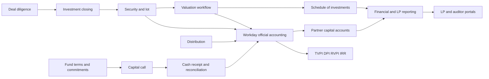

# 1829 Ventures Fund OS — Comprehensive Product and Implementation Plan

Status: proposed implementation plan
Created: 2026-07-13
Applies to: the existing 1829 Ventures CRM repository
Institutional owner: Rochester Institute of Technology (RIT)
Working product name: **Fund OS**

## 1. Executive decision

Evolve the existing company-centered CRM into RIT's internal operating system for 1829 Ventures and its funds. Carta is the functional benchmark for investment and fund operations: one connected product for fund entities, LP onboarding, commitments, capital activity, portfolio positions, valuations, reporting, documents, and controlled stakeholder access.

The product should not copy Carta's branding, layouts, copy, or trade dress. It should adopt the useful operating model: a fund event is entered once, approved once, and then flows into the ledger, partner balances, portfolio analytics, notices, reports, and portals without spreadsheet reconciliation.

The long-term product target is to replace Carta for 1829/RIT's internal investment and fund operations. It does **not** replace Workday, which remains RIT's accounting system of record. It is not a commercial fund-administration product for other firms. The rollout remains narrower than acting as a regulated or professional third-party administrator:

- RIT uses the platform as the detailed investment-operational system of record and fund subledger, with Workday journal references and reconciliation status.
- Workday remains authoritative for the university general ledger, accounting periods, institutional financial statements, cash/accounting actuals, and university financial approvals.
- External legal, tax, banking, KYC/AML, audit, and fund-administration providers remain authoritative where professional review is required.
- The platform produces reviewable calculations, workpapers, notices, statements, exports, and audit trails.
- No release moves money, files taxes, countersigns legal agreements, or represents a valuation as independently certified unless an explicitly integrated and approved provider performs that action.
- Accountants and administrators are the first external users; the LP portal follows after internal books and reports are dependable.
- After multiple reconciled quarter closes, Fund OS may become the primary investment-operational book and the corresponding Carta workflows can be retired; Workday remains the accounting book.

This boundary captures Carta's operational leverage while fitting RIT's institutional controls: Fund OS provides investment-level detail and workflows, and Workday receives or validates the accounting consequences.

## 2. Success definition

The platform is successful when the fund team can answer these questions from one auditable source without rebuilding a spreadsheet:

1. What legal entities and funds do we manage, and what are their governing economic terms?
2. Who are our LPs, what did each commit, what has each contributed, received, and still owes?
3. What capital activity is drafted, approved, issued, due, late, partially paid, or complete?
4. What securities does each vehicle own, what did they cost, what is their current approved fair value, and which documents support the position?
5. What are gross and net TVPI, DPI, RVPI, MOIC, and IRR as of a chosen date, and exactly which cash flows produced them?
6. What is the fund's cash position, unfunded commitments, reserves, deployable capital, and forecast runway?
7. Can an LP securely retrieve only its own notices, statements, tax documents, commitments, and approved performance data?
8. Can an accountant, administrator, or auditor trace every report line from Fund OS to its source event, approval, supporting document, Workday export/import batch, and Workday accounting reference?
9. Can the team close a quarter through a visible checklist with reconciliations, exceptions, reviews, and a locked reporting period?
10. Can the team see Fund 1 and Fund Beta positions separately and together, with reliable cost, ownership, current value, operating health, follow-on needs, and missing-data warnings?
11. Can a new prospect move from ranked outreach candidate to deal, diligence, investment closing, and portfolio position without duplicate records or lost relationship history?

### Product-level outcomes

- One source of truth for fund terms, investor records, capital activity, investments, and approved valuations.
- No hardcoded portfolio return values or user-entered fund-level performance ratios.
- Every financial number is computed from dated cash flows, positions, valuations, and reconciled accounting facts; official accounting balances tie to Workday.
- Every sensitive change has actor, timestamp, reason, source, approval state, and history.
- Segregation of duties is enforceable: the same person should not silently prepare, approve, and finalize a high-risk event.
- Existing CRM sourcing, diligence, outreach, document, task, and Ritchie workflows continue to work.
- Portfolio monitoring and new-investment outreach become the first daily-use surfaces, while accounting and fund-administration replacement proceeds behind reconciled release gates.

## 3. Assumptions used for this plan

These assumptions allow implementation to begin without blocking on product interviews. They are decision points, not hidden facts.

- Initial jurisdiction: United States.
- Initial structure: closed-end venture funds organized as partnerships, with related GP and management-company entities; SPVs are supported by the same entity model.
- Base currency: USD. Store original transaction currency and FX metadata from the beginning, but defer true multi-currency accounting.
- Firm model: one 1829 organization with multiple funds and legal entities. The schema will be organization-scoped so another firm cannot be added accidentally without proper isolation.
- Human users: internal team, LPs, GP members, auditors, external fund administrators/accountants, and read-only advisors.
- Fund economics: commitments, management fees, carry, preferred return, GP catch-up, recycling, and fund expenses are configurable and versioned. No economic term is buried in application code.
- Accounting: Workday is RIT's official general ledger and accounting system. Fund OS maintains a detailed investment-operational subledger, prepares controlled accounting events/journal proposals, imports Workday actuals or reports, and reconciles the two. Accounting policy, mappings, and final classifications require RIT accounting approval.
- Valuations: quarterly and material-event workflows with configurable methodologies and supporting evidence. The software supports the process; it does not replace valuation judgment.
- Banking: CSV/OFX-style transaction import and reconciliation first. Read-only bank feeds second. Payment initiation and wire approval are later and separately authorized.
- Closings: guided data collection, document upload, status tracking, e-sign provider integration, and countersign workflow. The app will not invent subscription documents or legal terms.
- Tax: secure delivery and status tracking for K-1s and other tax documents, not tax preparation in the first release.
- Portfolio cap tables: record the fund's securities, lots, ownership snapshots, and scenario inputs. Do not attempt issuer-grade cap table administration in the initial program.

### Confirmed 1829 direction

- **Pilot vehicle:** Fund 1 is the active operating pilot.
- **Continuing historical vehicle:** Fund Beta's portfolio companies remain active and must be included in portfolio monitoring, follow-ons, valuations, documents, and company-level rollups. Fund Beta is not treated as disposable legacy data.
- **End state:** replace Carta for 1829's internal use after controlled reconciliation and cutover, rather than indefinitely running a duplicate system.
- **Institutional boundary:** RIT owns and operates the software; Workday continues to handle official accounting and is not being replaced.
- **First external collaboration:** accountants and administrators receive the first external workspace and controlled exports/imports.
- **Immediate product priorities:** portfolio tracking and outreach to prospective investments.
- **Available legal records:** no LPA is currently available for implementation. Until an executed governing agreement or accountant/counsel-approved term schedule is supplied, management fees, allocations, recycling, waterfall, carry, and other fund-economic calculations remain provisional or disabled.
- **Migration source:** Carta can provide CSV/Excel reports for investments, transactions, valuations, commitments, and related fund data. Fund Beta will be imported in full; active/held classification can be completed after migration and does not block the first build.

### Consequence of the missing LPA

The absence of an LPA does not block company outreach, position tracking, document collection, portfolio metrics, transaction histories, or provisional performance views. It does block representing fund-term-dependent calculations as authoritative. The implementation must therefore:

- Add a `term_source_status` such as `missing`, `provisional`, `verified`, or `superseded` to every term version.
- Allow a clearly watermarked provisional term schedule assembled from administrator statements, subscription documents, prior call/distribution notices, current Carta exports, and accountant interviews.
- Store the source and confidence for every provisional term.
- Prohibit final fee, waterfall, carry, partner-allocation, and capital-call compliance approval while required governing terms are missing.
- Replace provisional terms with a new verified version when executed documents become available; never rewrite prior snapshots silently.

## 4. Current repository assessment

### 4.1 Strong foundations to keep

The current codebase already provides:

- FastAPI, SQLAlchemy, Alembic, Postgres, Redis/Celery, and S3-compatible document storage.
- React/Vite/TypeScript, TanStack Query, protected routing, shared UI components, and generated OpenAPI types.
- Company, person, contact, interaction, deal, diligence, document, task, notification, import, audit, and agent-policy domains.
- Basic `Fund`, `Investment`, and `PortfolioMetric` records.
- Portfolio views and analytics scaffolding.
- Google OAuth, a persistent user model, soft deletion, background jobs, and a general audit service.
- A company-centered workflow that should remain the front-office system for sourcing through investment.

### 4.2 Material gaps

The current fund model is a label plus committed capital. The investment model is a single aggregate row. Portfolio metrics permit TVPI, DPI, and IRR to be stored as inputs, and the frontend currently compensates for missing cash-flow data with hardcoded returned capital. That is appropriate CRM scaffolding, but it is not yet the detailed investment-operational system or Workday-reconciled fund subledger RIT needs.

Missing capabilities include:

- Legal entities and entity relationships.
- Investors/LP legal profiles, beneficial owners, signatories, tax/KYC statuses, and secure instructions.
- Fund terms, closings, subscriptions, commitments, transfers, and side-letter obligations.
- Capital calls, distributions, allocations, receipts, partial payments, notices, and delinquency workflows.
- Workday account/worktag mappings, balanced accounting proposals, integration batches, official-actuals imports, operational-subledger reconciliation, and investment reporting workpapers.
- Security/lot-level positions, conversions, exits, write-offs, realized gains, proceeds, and position roll-forwards.
- Approved valuation cases and histories.
- Partner capital accounts and allocation calculations.
- Quarterly close and report-package workflows.
- LP, auditor, and external-administrator portals.
- Financially meaningful permissions, dual approvals, Workday-aware period controls, and immutable accepted/reconciled records.
- Versioned report definitions, calculation provenance, and as-of-date correctness.

### 4.3 Technical debt to resolve before financial workflows

- Human roles exist but are not enforced; all fund data currently uses the broad `CRM` permission resource.
- The app is effectively single-tenant without explicit organization scoping.
- Monetary model fields are typed as `float` in Python even when backed by `NUMERIC`; financial code must use `Decimal` end to end.
- Audit logs are useful change records but are not an immutable operational event/subledger and do not implement prepare/approve/export/reconcile controls.
- Documents can link to company, deal, or person, but not generic legal entities, investors, capital events, journals, valuations, reporting periods, or report packages.
- Core list endpoints use offset pagination and broad limits; fund event and ledger tables should use stable sorting and cursor pagination where volume or concurrent writes matter.

## 5. Product principles

1. **Event once, propagate everywhere.** A funded capital call creates its accounting consequences, investor balances, dashboards, and report inputs through one controlled event.
2. **Workday-accepted means immutable.** Correct accepted accounting through a controlled reversal or adjustment linked to Workday; never edit history in place.
3. **As-of date is mandatory.** Fund performance, ownership, valuations, and balances are meaningless without an effective date.
4. **Terms are data.** Fund economics and allocation rules are effective-dated, versioned records with supporting documents.
5. **Explain every number.** A user can drill from a dashboard total to a report line, journal, source event, allocation, cash flow, and document.
6. **Workflow state is not accounting state.** An approved notice is not cash; a Fund OS receipt record is not official accounting until reconciled to Workday; a proposed valuation is not an approved mark.
7. **Least privilege by entity and role.** LPs see only their own records; external users see only explicitly granted entities and periods.
8. **No AI authority over money or books.** Ritchie may extract, suggest, reconcile, and draft. Humans approve financial events, terms, valuations, journals, external communications, and period closes.
9. **Configuration over one-off code.** Charts of accounts, notice templates, report visibility, fund terms, fee policies, and close checklists should be configurable and versioned.
10. **Reconciliation over confidence.** Imported or calculated data remains unverified until it passes explicit checks and review.

## 6. Users and permissions

### 6.1 Personas

| Persona | Primary jobs |
| --- | --- |
| Managing partner | Review fund health, approve capital activity and valuations, communicate with LPs, inspect carry scenarios |
| Fund operations/CFO | Maintain entities and terms, run calls/distributions, close investment periods, reconcile Fund OS to Workday, publish reporting |
| Investment professional | Move deals into investments, maintain security and valuation evidence, monitor companies, model reserves |
| Analyst | Prepare data, documents, transactions, valuations, reconciliations, and reporting workpapers |
| LP/investor | Complete onboarding, maintain approved profile data, view own commitment/activity/performance, retrieve documents |
| GP member | View own commitment, capital account, vesting, and carry information where enabled |
| RIT accountant/finance partner | Own Workday mappings and official accounting treatment, review Fund OS events, resolve reconciliation exceptions, and approve reporting inputs |
| External administrator/accountant | Exchange fund records, review exceptions, and prepare or approve fund reports within assigned entities |
| Auditor | Read-only access to locked periods, reports, journals, reconciliations, valuations, and support documents |
| System agent/Ritchie | Narrow, policy-controlled extraction, drafting, matching, exception detection, and summaries |

### 6.2 Permission model

Replace the single broad CRM permission with organization- and entity-scoped RBAC plus contextual checks.

Permission resources:

- `organization`, `legal_entity`, `fund_terms`, `investor`, `commitment`, `closing`
- `capital_activity`, `banking`, `investment`, `position`, `valuation`
- `accounting`, `reporting_period`, `report_package`, `document`
- `portal_access`, `tax_document`, `carry`, `forecast`, `integration`, `agent_policy`

Actions:

- `read`, `create`, `update`, `submit`, `approve`, `reject`, `export`, `reconcile`, `reverse`, `publish`, `lock`, `unlock`, `manage`

Required controls:

- Store membership, role, and legal-entity grants separately.
- Enforce permissions in services, not only routes or the UI.
- Require recent re-authentication for bank instructions, portal identity changes, publishing, and high-risk approvals.
- Support approval policies by event type and dollar threshold.
- Prevent self-approval where policy requires dual control.
- Record delegated authority with start/end dates.
- Mask account numbers, tax IDs, and sensitive PII by default.
- Audit reads/downloads of sensitive documents and bank instructions, not only writes.

### 6.3 RIT institutional requirements

- Use RIT's approved single sign-on and identity lifecycle for employees; Google OAuth is development scaffolding unless RIT confirms it as the institutional provider.
- Map RIT groups/roles to application permissions without treating an HR title as automatic financial authority.
- Complete RIT security, privacy, accessibility, records-retention, vendor/integration, and architecture reviews before production use.
- Treat alumni, founder, investor, portfolio, tax, banking, and legal data according to RIT's data-classification policy.
- Review whether any student or education-record data enters the system; apply FERPA controls only where applicable rather than assuming all university-adjacent data is a student record.
- Meet the university's accessibility standard for internal software, including keyboard navigation, screen-reader semantics, contrast, focus management, and accessible documents.
- Use RIT-managed secrets, service accounts, network controls, backups, monitoring, and incident-response processes in production.
- Keep the Workday integration service account separate from human accounts and grant only the reports/import actions approved by RIT Finance and Workday administrators.

## 7. Information architecture

The existing CRM navigation remains the front-office area. Add a fund-operations area with entity context always visible.

```text
Home
CRM
  Companies
  People
  Deals
  Outreach
  Tasks
Fund Operations
  Overview
  Entities & Funds
  Investors & Closings
  Capital Activity
  Portfolio & Positions
  Valuations
  Accounting
  Quarter Close
  Reports & Documents
  Forecasting
Portals
  LP Access
  Auditor Access
Administration
  Users & Roles
  Integrations
  Templates
  Agent Policy
  Audit Log
```

Global behavior:

- Persistent organization/entity/fund selector.
- Every page displays its effective `as of` date or reporting period.
- Global search respects permissions and entity scope.
- Action center shows approvals, overdue payments, unreconciled cash, missing documents, stale valuations, close tasks, and integration errors.
- Financial pages offer drill-through rather than dead summary cards.

## 8. End-to-end operating model



Fund OS is the investment-operational spine; Workday is the accounting spine. Operational records retain workflow and security-level detail, while linked Workday references represent the official accounting effect. Derived balances and reports can be rebuilt from source data and must expose reconciliation status.

## 9. Functional scope

### 9.1 Organization, entities, and fund terms

Capabilities:

- Organization profile, fiscal year, base currency, branding, and policy defaults.
- Legal entities: fund, GP, management company, SPV, blocker, feeder, warehousing entity, and other.
- Entity relationship graph with ownership/control and effective dates.
- Formation jurisdiction, legal name, display name, tax classification, masked tax ID, status, bank-account references, and governing documents.
- Funds link to a legal entity and keep investment-strategy metadata.
- Effective-dated fund terms: target/committed size, term and extensions, investment period, management fee schedules, carry, preferred return, catch-up, recycling, GP commitment, expense allocation policy, default/cure terms, and amendment history.
- Side-letter obligation register with owner, applicability, due date, review cadence, and confidential attachments.
- Entity onboarding checklist and completeness status.

Acceptance criteria:

- A fund cannot issue a capital call until required entity data, terms, wire instructions, and approvals are complete.
- Updating an economic term creates a new version; it never rewrites calculations already finalized for an earlier effective date.
- Every fund record identifies its legal entity, current term version, open reporting period, and external service providers.

### 9.2 Investors, fundraising, and closings

Capabilities:

- Investor account distinct from a person/contact: individual, trust, family office, company, fund, foundation, or other legal subscriber.
- Related contacts, beneficial owners, authorized signatories, tax profile, accreditation/qualification status, and communication preferences.
- KYC/AML status and evidence metadata from an approved provider; do not store more raw identity evidence than necessary.
- Fundraising pipeline from prospect through invited, documents in progress, signed, countersigned, funded, declined, or withdrawn.
- Closing rounds and effective dates.
- Subscription packet templates supplied or approved by counsel.
- E-sign integration, reminder workflow, designated signatory, countersign, and immutable executed-document storage.
- Commitment creation only from an approved/countersigned subscription or a documented administrative migration.
- Commitment changes, transfers, cancellations, and close equalization/subsequent-close interest with reviewable calculations.
- Most-favored-nation/side-letter tracking as obligations, not unstructured notes alone.

Acceptance criteria:

- A signed PDF alone does not alter committed capital until the closing workflow is approved.
- The commitment roll-forward ties opening commitments plus subscriptions/transfers/amendments to ending commitments.
- Each investor can have multiple commitments across funds without duplicating its legal profile.

### 9.3 Workday accounting boundary and operational subledger

Build a detailed investment-operational subledger and Workday reconciliation layer. Do not build a second institutional general ledger or duplicate Workday accounts payable, cash management, period control, consolidation, or university financial statements.

Capabilities:

- Fund-level operational accounts and classifications mapped to RIT's Workday ledger accounts, worktags, funds, cost centers, projects, spend/revenue categories, and other dimensions actually approved by RIT Finance.
- Detailed subledger events and balanced journal proposals using `Decimal`, currency, effective date, proposed Workday accounting date, source type/id, preparer, approver, and attachments.
- Proposal/synchronization states: `draft -> submitted -> rit_approved -> exported -> workday_accepted -> reconciled`; plus `rejected`, `workday_error`, `reversed`, and `superseded` outcomes.
- Workday reference fields: integration batch ID, journal ID/number, accounting date, ledger/company, status, error code/message, accepted totals, and last-synchronized timestamp.
- RIT-approved mapping versions and transformation rules with effective dates and change history.
- Outbound batch/interface generation and inbound status/actuals ingestion. The exact mechanism may be Workday reports plus approved imports initially, and later EIB, Studio, Orchestrate, APIs, or Accounting Center depending on RIT's licensed and approved capabilities.
- Workday actuals/trial-balance/report import with staging, validation, deduplication, mapping, and variance reconciliation.
- Investment-detail workpapers, partner/fund roll-forwards, SOI, and report support that reconcile to Workday official balances.
- Error queue for unmapped worktags/accounts, closed Workday periods, duplicate events, rejected journals, and amount/date differences.
- Close checklist that requires Workday acceptance and reconciliation before Fund OS reporting is finalized.

Invariants:

- Sum of proposed debits equals proposed credits before an event can be exported.
- Fund OS never claims an event is officially posted until Workday returns or an RIT accountant records an accepted Workday reference.
- A source-event idempotency key and Workday external reference prevent duplicate export/posting.
- Reversals/corrections reference the original Fund OS event and Workday journal; accepted history is immutable in Fund OS.
- Fund OS respects Workday period status and cannot silently backdate an accepted accounting event.
- Official-accounting report lines derive from Workday actuals; investment-operational reports clearly identify unreconciled subledger amounts.
- Imported Workday/administrator records preserve source batch, external IDs, original payload hashes, mappings, and reconciliation decisions.
- A mapping change cannot retroactively alter a previously reconciled batch without a new controlled adjustment.

### 9.4 Banking, cash, and reconciliation

Capabilities:

- Bank-account metadata per legal entity, with encrypted tokens and masked display values.
- Initial CSV import format with saved bank mappings; later add a read-only aggregator.
- Bank transactions with pending/posted status, value date, amount, counterparty, memo, and source identity.
- Match one bank or Workday cash transaction to one or many operational events/accounting proposals; support splits and grouped deposits.
- Reconciliation sessions by account and statement end date.
- Suggested matches with confidence; human confirmation required.
- Outstanding checks/wires, deposits in transit, duplicate detection, and unexplained cash exceptions.
- Daily cash dashboard and 13-week directional cash forecast.

Acceptance criteria:

- A reconciliation proves operational cash expectations and any imported bank detail tie to official Workday cash/accounting actuals plus documented reconciling items.
- Editing wire instructions requires step-up authentication, dual review, full audit history, and out-of-band operational policy.
- The first release never initiates a wire.

### 9.5 Capital calls

Capabilities:

- Draft a call by fixed total, percentage of commitment, or per-investor override.
- Allocate by commitment while respecting exclusions, prior activity, commitment changes, and documented fund terms.
- Purpose buckets: investments, management fees, fund expenses, reserves, other.
- Validate call limits, dates, required data, investor eligibility, remaining uncalled commitment, and notice totals.
- Prepare/approve/issue workflow with notice preview for every investor.
- Email and portal delivery records; immutable published notice version.
- Due dates, reminders, waived/extended dates, partial receipts, over/underpayments, late status, default escalation, and reconciliation.
- Initial, subsequent-close, regular, and custom/equalization calls.
- Automatic draft journal only when the accounting policy says the economic event is recognizable; final receipt journals arise from reconciled cash.

State model:

`draft -> submitted -> approved -> issued -> partially_funded -> funded -> closed`

Exceptional states: `rejected`, `cancelled_before_issue`, `voided_after_issue`, and `overdue`. An issued call is corrected with a documented amendment/void workflow, not silent edits.

Acceptance criteria:

- Investor allocations sum exactly to the event total after deterministic rounding.
- Every allocation shows opening commitment, prior called capital, this call, and remaining uncalled commitment.
- Receipt status comes from reconciled cash or an explicitly reviewed manual receipt, never email delivery.

### 9.6 Distributions

Capabilities:

- Cash, in-kind, tax, recallable, and net call/distribution event types.
- Source-of-proceeds link to realization, income, return of capital, or other approved category.
- Versioned waterfall configuration and calculation engine.
- Allocation preview with capital/income/gain/carry/tax characterization.
- Prepare/approve/publish workflow, payment tracking, notice generation, and journals.
- Recallable distribution tracking and effect on remaining callable capital.
- Wire-instruction confirmation workflow without exposing full details broadly.
- Distribution true-up and correction through a new event or adjusting journal.

Acceptance criteria:

- Distribution allocations tie to the approved event total and configured waterfall version.
- A user can reproduce the calculation from inputs, tiers, rates, and rounding decisions.
- Net and gross performance update from dated cash flows only after the relevant event is recognized under the reporting policy; official accounting classifications reconcile to Workday.

### 9.7 Investments, securities, and positions

Replace the aggregate investment row as the economic source of truth while retaining compatibility during migration.

Capabilities:

- Investment closing workflow linked to an approved CRM deal and company.
- Security master: preferred/common equity, SAFE, convertible note, debt, warrant, fund interest, crypto/other only when explicitly enabled.
- Security terms appropriate to the instrument: shares/units, price, principal, interest, maturity, cap, discount, seniority, liquidation preference, participation, conversion terms, and currency.
- Transaction/lot ledger: purchase, fee/cost, conversion, split, follow-on, transfer, disposition, write-off, interest, dividend, and non-cash event.
- Ownership snapshots with fully diluted denominator and provenance rather than treating ownership percentage as timeless.
- Position roll-forward by fund, company, security, and lot.
- Realization workflow and realized gain/loss calculation.
- Investment documents checklist and missing-document exceptions.
- Schedule of investments generated as of a selected date.
- Cross-fund exposure and concentration views.

Acceptance criteria:

- Cost basis, quantity, proceeds, realized gain, and remaining position rebuild exactly from transactions.
- A SAFE conversion preserves lineage from original lot to resulting security.
- Archiving an investment never removes its transaction history, Workday accounting references, or prior-period reports.

### 9.8 Portfolio data collection and monitoring

Capabilities:

- Configurable metric definitions by company and stage.
- Reporting requests and reminders to portfolio company contacts.
- Secure data-entry/upload experience for authorized portfolio contacts later; internal entry and import first.
- Time-series metrics with source, units, currency, reporting basis, confidence, and approval state.
- Revenue, burn, cash, runway, headcount, ARR/MRR, debt, financing, KPI, and custom metrics.
- Validation rules, period-over-period variance flags, stale-data warnings, and document evidence.
- Portfolio monitoring dashboard and board/observer-rights register.

The existing `PortfolioMetric` table should be migrated into versioned metric observations. TVPI, DPI, and IRR must be removed as user-entered portfolio-company metrics.

### 9.9 Valuations

Capabilities:

- Valuation policy registry with cadence, material-event rules, thresholds, approvers, and methodology guidance.
- Valuation cycle by reporting period.
- Per-position valuation case with cost, latest financing, public comparable, precedent transaction, DCF, option-pricing/backsolve, waterfall, or other approved methodology.
- Inputs, adjustments, calibration, scenario ranges, selected value, rationale, evidence, reviewer comments, and conflict disclosure.
- Workflow: `draft -> submitted -> changes_requested -> approved -> superseded`.
- An approved mark updates the SOI and, when RIT accounting policy requires, creates a controlled Workday accounting proposal.
- Backtesting against later transactions/exits.
- Stale mark and missing support exceptions.

Acceptance criteria:

- Only one approved current mark exists per position and as-of date, while full history remains available.
- Every valuation used in reporting identifies method, preparer, approver, source evidence, and policy version.
- A financing event may propose a mark but cannot silently approve it.

### 9.10 Partner capital accounts and fund economics

Capabilities:

- Partner opening balances and migration workpapers.
- Contributions, distributions, income/loss allocations, expenses, management fees, realized/unrealized gains, carry allocations, transfers, and ending capital.
- Allocation engine configured from effective fund terms and accounting policy.
- GP commitment handled as a partner commitment, not a special hardcoded exception.
- Management fee schedules with basis changes, offsets, waivers, breakpoints, and step-downs.
- Carry waterfall scenarios separate from booked carry.
- Partner capital account statement generation.
- Explainable roll-forward and tie-out to the ledger.

Acceptance criteria:

- Total partner ending capital ties to the fund's net assets attributable to partners.
- Every allocation run is versioned and reproducible.
- Changing a term never mutates a finalized prior-period allocation.

### 9.11 Performance and forecasting

Capabilities:

- Gross and net TVPI, DPI, RVPI, MOIC, IRR/XIRR with documented sign conventions.
- Fund, vintage, company, investment, and realized/unrealized views.
- Performance as of any supported date using approved valuations and recognized cash flows.
- Fund construction: target checks, ownership, pacing, reserves, fees/expenses, recycling, and deployment budget.
- Base/upside/downside company scenarios.
- Reserve allocation model with actual versus planned follow-ons.
- J-curve and cash-flow forecasts.
- Snapshot and compare scenarios; no forecast overwrites actuals.

Acceptance criteria:

- Every metric endpoint returns the as-of date, calculation version, included cash-flow IDs, valuation set, and warnings.
- Results are validated against independent spreadsheet fixtures for edge cases.
- Missing or stale valuation inputs display uncertainty rather than a misleading precise return.

### 9.12 Quarterly close and reporting

Capabilities:

- Reporting calendar and period-specific close checklist.
- Task dependencies, owner, reviewer, due date, evidence, status, and exceptions.
- Bank reconciliations, investment roll-forward, valuation approvals, expense/accrual review, commitment roll-forward, partner allocations, trial balance review, and subsequent-events review.
- Soft close for review and hard close for published reporting.
- Versioned report packages: financial statements, SOI, performance summary, partner capital statements, capital activity, investor letter, and supporting schedules.
- Draft watermark, approval, publication, withdrawal/correction, and recipient visibility.
- Data-room export with manifest and file hashes.

Acceptance criteria:

- A period cannot hard-close while blocking tasks or unreconciled exceptions remain unless an authorized override records the rationale.
- Published reports are immutable artifacts tied to a calculation snapshot and source records.
- Corrections create a new report version and notify affected recipients.

### 9.13 LP portal

Capabilities:

- Separate portal shell and authorization boundary from the internal application.
- Investor organization with multiple portal users and delegated signatories.
- Dashboard for commitment, called capital, contributed capital, distributions, remaining commitment, and approved performance visibility.
- Capital-call/distribution notices, executed subscription documents, LPAs, quarterly reports, PCAPs, K-1s, and other tax documents.
- Secure profile-change requests for contacts, addresses, tax forms, and wire instructions; sensitive changes require internal review.
- Notification preferences and delivery history.
- GP controls which metrics/documents are visible by fund, investor, and report package.
- Support request/message thread with retention and audit.

Acceptance criteria:

- Cross-investor data access is denied at the query level and covered by adversarial authorization tests.
- Portal totals tie to published report snapshots, not live draft data.
- Download access is time-limited, audited, and revoked when portal membership is disabled.

### 9.14 Auditor and administrator access

Capabilities:

- Read-only auditor workspace organized by entity, year, and audit area.
- Direct access to locked reports, journal support, reconciliations, SOI, valuation workpapers, legal documents, and confirmation status.
- Request list with owner, due date, response, evidence, and completion status.
- External administrator staging workspace for imports, proposed adjustments, comments, and reconciliations.
- No external user can export accounting proposals, reconcile Workday records, publish, unlock, or change terms unless explicitly granted.

### 9.15 Documents, communications, and notifications

Extend the existing document system into a polymorphic, permission-aware record service.

- `DocumentLink` associates one document with any supported entity without adding nullable foreign keys indefinitely.
- Document categories, confidentiality level, retention policy, reporting period, version family, signature status, and source hash.
- Virus scanning/quarantine before confirmation in production.
- Template engine for notices and statements with versioned merge fields.
- Preview every recipient-specific artifact before publication.
- Store rendered PDF, template version, input snapshot, delivery event, and recipient.
- Never email sensitive attachments by default; email a portal link.
- Notification events are idempotent, retryable, and record provider delivery status.

### 9.16 Ritchie/agent assistance

Safe initial agent capabilities:

- Extract structured data from approved source documents into a staging record.
- Match bank transactions, documents, contacts, and investment records with confidence and reasons.
- Draft journal descriptions, close checklist notes, notice copy, investor responses, and portfolio summaries.
- Identify reconciliation breaks, missing support, stale valuations, side-letter obligations, and anomalous changes.
- Answer permission-scoped questions with citations to internal records.

Never agent-authorized without human approval:

- Change fund terms, commitments, bank instructions, or investor identity.
- Approve/export/reconcile/reverse accounting proposals or Workday-linked events.
- Approve valuations or allocation runs.
- Issue calls/distributions, move money, countersign documents, publish reports, or send investor communications.
- Close/reopen accounting periods.

Every agent suggestion stores prompt/context references, model/version, structured output, confidence, human disposition, and resulting record IDs using the existing policy and event-log foundations.

## 10. Target data model

The model names below are conceptual and may be adjusted to repository conventions. UUID primary keys, timestamps, organization scope, optimistic version, actor provenance, and relevant effective dates are standard unless noted.

### 10.1 Identity and scope

- `Organization`
- `OrganizationMembership`
- `LegalEntity`
- `LegalEntityRelationship`
- `EntityAccessGrant`
- `ApprovalPolicy`
- `ApprovalRequest` and `ApprovalDecision`
- `ExternalParty` for service providers, banks, auditors, and counsel

### 10.2 Funds and terms

- `Fund` extended with `organization_id`, `legal_entity_id`, strategy, dates, and current term version
- `FundTermVersion`
- `FundTermRule` or typed term tables for fee/waterfall rules
- `SideLetterObligation`
- `ReportingCalendar`

### 10.3 Investors and closings

- `InvestorAccount`
- `InvestorContact`
- `InvestorBeneficialOwner`
- `InvestorTaxProfile`
- `InvestorComplianceCheck`
- `PortalMembership`
- `FundraisingProspect`
- `Closing`
- `Subscription`
- `Commitment`
- `CommitmentTransaction`
- `InvestorTransfer`

### 10.4 Capital activity

- `CapitalActivityEvent`
- `CapitalActivityBucket`
- `CapitalActivityAllocation`
- `PaymentExpectation`
- `PaymentReceipt`
- `Notice` and `NoticeDelivery`
- `WaterfallDefinition`, `WaterfallVersion`, and `WaterfallRun`

One capital-activity model supports calls, distributions, and net/custom events while typed validations prevent impossible field combinations.

### 10.5 Workday accounting integration, operational subledger, and cash

- `InvestmentReportingPeriod` with Workday period references/status
- `OperationalAccount`
- `WorkdayMappingVersion` and `WorkdayMappingRule`
- `AccountingEventProposal`
- `AccountingEventProposalLine`
- `WorkdayIntegrationBatch`
- `WorkdayAccountingReference`
- `WorkdayActualsImport` and `WorkdayActualsRow`
- `AllocationRun` and `AllocationLine`
- `BankAccount`
- `BankTransaction`
- `ReconciliationSession`
- `ReconciliationMatch`
- `ImportedAccountingBatch` and `ImportedAccountingRow`
- Materialized operational balances rebuilt from source events, with separate reconciled Workday balances

### 10.6 Investments and valuations

- Existing `Company` and `Deal`
- `InvestmentClosing`
- `Security`
- `InvestmentTransaction`
- `TaxLot`
- `PositionSnapshot` as a derived/cache model, never an independent editable truth
- `OwnershipSnapshot`
- `ValuationPolicy`
- `ValuationCycle`
- `ValuationCase`
- `ValuationInput`
- `ValuationApproval`
- `MetricDefinition`, `MetricObservation`, and `MetricRequest`

### 10.7 Reporting and controls

- `CloseChecklistTemplate`
- `CloseTask`
- `CloseException`
- `ReportDefinition`
- `ReportRun`
- `ReportArtifact`
- `Publication`
- `Document`
- `DocumentLink`
- `SensitiveDataAccessLog`

### 10.8 Common technical fields

Financial records should consistently include:

- `organization_id`, `legal_entity_id`, and where applicable `fund_id`
- `effective_date`, `recorded_at`, and `accounting_period_id`
- `status` and explicit state-transition timestamps
- `source_type`, `source_id`, `external_id`, `idempotency_key`, and payload/file hash
- `prepared_by`, `submitted_by`, `approved_by`, `exported_by`, and Workday accepted/reconciled actor references with timestamps
- `version` for optimistic locking
- `currency`, `amount` as `NUMERIC`, and optional FX metadata
- `reason`, `notes`, and supporting document links

## 11. Calculation and accounting architecture

### 11.1 Money and precision

- Use Python `Decimal`, Pydantic decimal types, Postgres `NUMERIC`, and decimal-safe JSON serialization.
- Centralize currency minor-unit and rounding policies.
- Allocate remainders deterministically, record who received them, and test that allocations always tie.
- Never calculate financial values with JavaScript floating-point on the client. The frontend formats server-calculated values.

### 11.2 Event-to-Workday accounting adapters

Operational services emit a domain event only after their transaction commits. An idempotent worker or in-transaction adapter builds a balanced accounting proposal using an RIT-approved, versioned mapping. RIT Finance approval and Workday acceptance remain separate controlled actions.

Examples:

- Reconciled contribution receipt -> proposed Workday cash/partner-contribution accounting.
- Investment purchase -> proposed investment cost and cash/payable accounting.
- Approved valuation -> proposed unrealized appreciation/depreciation accounting when RIT policy requires it.
- Distribution -> proposed cash reduction and partner distribution/allocation accounting.
- Management fee accrual -> proposed expense and payable/intercompany accounting.

The adapter stores the mapping version and source-event identity. Reprocessing the same event cannot duplicate an export. Workday results are imported and matched back to the proposal before it becomes `reconciled`.

### 11.3 Derived projections

Use read models/materialized views for dashboards:

- Commitment and uncalled-capital balances.
- Partner capital roll-forwards.
- Position and cost-basis roll-forwards.
- Cash and reconciliation status.
- SOI.
- Performance cash-flow sets.

Each projection has a rebuild command and parity test against source records. Avoid storing editable copies of derived totals.

### 11.4 Calculation service contract

Every important calculation returns:

- Result and unit/currency.
- As-of date and accounting/reporting period.
- Input record IDs and input hash.
- Rule/calculation version.
- Rounding policy.
- Warnings, missing data, and stale inputs.
- Optional explanation tree for UI drill-through.

## 12. API plan

Keep thin routes, service-layer rules, repositories for query isolation, and background workers for document/render/import work.

Representative endpoint groups:

```text
/api/organizations
/api/legal-entities
/api/funds/{fund_id}/terms
/api/investors
/api/closings
/api/subscriptions
/api/commitments
/api/capital-activities
/api/capital-activities/{id}/allocations
/api/capital-activities/{id}/submit|approve|issue|void
/api/bank-accounts
/api/bank-transactions
/api/reconciliations
/api/operational-accounts
/api/accounting-proposals
/api/accounting-proposals/{id}/submit|approve|export|reverse
/api/workday/mappings
/api/workday/batches
/api/workday/actuals-imports
/api/workday/reconciliations
/api/investment-reporting-periods/{id}/soft-close|finalize|reopen
/api/investment-closings
/api/securities
/api/investment-transactions
/api/positions
/api/valuation-cycles
/api/valuations/{id}/submit|approve
/api/metrics
/api/close-periods
/api/report-runs
/api/publications
/api/portal/me
/api/portal/commitments
/api/portal/documents
/api/auditor/entities
```

API rules:

- Commands use explicit transition endpoints rather than arbitrary `PATCH status`.
- Require `Idempotency-Key` for externally retryable financial commands.
- Use optimistic concurrency (`version`/ETag) for mutable drafts.
- Return `409` for version conflicts and invalid concurrent transitions.
- Use cursor pagination and stable ordering for journals, transactions, notices, and audit events.
- Generate and commit frontend OpenAPI types with every API change.
- Never return sensitive raw fields to a caller who only needs masked display data.
- Exports run asynchronously and return a job/artifact reference.

## 13. Frontend plan

### 13.1 Design system additions

- Entity/fund/as-of selectors.
- Money, percentage, date, accounting-period, and masked-sensitive-data fields.
- Status badge vocabulary shared across workflows.
- Approval timeline, preparer/reviewer panel, exception list, and audit drawer.
- Financial data table with server sorting/filtering, column chooser, export, sticky totals, and drill-through.
- Version comparison and source-evidence panel.
- Document preview and report publication preview.
- Calculation explanation tree.

### 13.2 Page delivery order

1. Fund/entity overview and readiness checklist.
2. Investor directory, investor detail, commitments, and closing tracker.
3. Chart of accounts, journals, trial balance, bank activity, and reconciliation.
4. Capital activity list, event builder, allocation review, notice preview, and receipt tracking.
5. Position ledger, investment closing, SOI, portfolio monitoring, and valuation cycle.
6. Quarter-close workspace and report-package builder.
7. LP portal.
8. Auditor/external administrator portal.
9. Forecasting, scenario modeling, and carry views.

The existing `PortfolioDashboard` should be replaced incrementally. During migration it must carry a clear “legacy/unreconciled” label and stop presenting hardcoded or manually stored ratios as authoritative.

## 14. Security, privacy, and operational controls

Before any LP portal or sensitive finance data reaches production:

- Explicit organization/entity scoping on every protected table and query.
- MFA or upstream identity-provider enforcement for internal users; portal MFA/passkey support.
- Short-lived sessions for external users and step-up authentication for sensitive changes.
- Encryption in transit and at rest; application-level encryption or vault references for account/tax secrets.
- Managed secret storage; no production secrets in `.env` files on hosts.
- Malware scanning and quarantine for uploads.
- Signed, short-lived download URLs with authorization checked before issuance.
- Content Security Policy, CSRF protection, secure cookie policy, rate limiting, and abuse controls.
- Append-only security/audit event export to separate durable storage.
- Database backups, point-in-time recovery, restore drills, object-versioning, and documented RPO/RTO targets.
- Data retention/deletion schedule that preserves required financial books and audit history.
- Incident response runbook and permission-revocation procedure.
- Dependency, container, SAST, migration, and secret scanning in CI.
- Independent penetration test before broad LP access or any money-movement integration.

## 15. Integrations

### Initial

- RIT-approved SSO/identity for production; existing Google identity may remain for local development until the institutional identity path is confirmed.
- S3-compatible document storage.
- Email provider for portal links and notifications.
- Carta CSV/XLSX exports for historical commitments, capital activity, investments, transactions, valuations, portfolio records, and document inventories.
- RIT-approved Workday reports/import templates for accounting actuals, mapping validation, accounting-event exchange, and reconciliation.
- PDF rendering service/library for controlled server-side artifacts.
- E-sign provider selected with counsel for subscription documents.

### Next

- Read-only bank aggregation.
- Workday integration through the mechanism selected by RIT's Workday team: approved APIs, EIB, Studio, Orchestrate, Accounting Center, or scheduled reports/imports.
- External fund-administrator export/import adapters where the administrator has fund detail not represented in Workday.
- Approved KYC/AML and tax-form provider.
- Portfolio-company data collection links/imports.
- Market-data provider for valuation workpapers.
- Accounting/spend provider integration for management-company or fund expenses.

### Later and separately approved

- Payment initiation or treasury.
- Tax preparation/filing.
- Cap-table provider sync.
- Regulatory filing workflows.

Every integration needs an owner, data contract, permission scope, reconciliation strategy, webhook signature verification, idempotency plan, retry/dead-letter behavior, and disable/revoke workflow.

### Workday connector contract

Implementation must not assume that RIT licenses a particular Workday integration product. Phase 0 defines a connector interface and proves it with approved files before automating it.

Outbound from Fund OS:

- Stable source-event ID and batch ID.
- RIT company/ledger and accounting date.
- Workday account and worktag/dimension values.
- Balanced debit/credit proposal or approved business-event format.
- Description, fund/company/investment context, and supporting-document references.
- Mapping version and preparer/approver audit data.

Inbound from Workday:

- Batch/import acceptance or error status.
- Workday journal/accounting reference and official accounting date.
- Accepted debit/credit totals and relevant dimensions.
- Period status and correction/reversal references.
- Actual balances or transaction detail required for reconciliation.

The connector validates totals, required worktags, allowed periods, duplicate external IDs, and mapping versions. An accepted Workday response never overwrites the original Fund OS event; it creates a linked accounting reference and reconciliation result.

## 16. Migration strategy

### 16.1 Schema evolution

- Add `Organization` and backfill one RIT/1829 organization with an explicit institutional-owner relationship.
- Add organization scope to current users and domain records in staged nullable -> backfill -> not-null migrations.
- Introduce `LegalEntity`; map each existing `Fund` to a fund legal entity after user review.
- Preserve current fund and investment IDs where practical for stable links.
- Introduce new security and investment-transaction records alongside legacy `Investment` rows.
- Transform existing portfolio metrics into `MetricObservation` staging records.
- Do not convert stored TVPI/DPI/IRR into accounting truth.

### 16.2 Historical data onboarding

Create a reusable migration center with this order:

1. Legal entities, terms, and bank metadata.
2. Investors and contacts.
3. Commitments and historical commitment changes.
4. Historical capital calls, distributions, and receipts.
5. Workday actuals/opening accounting references and partner capital accounts where available.
6. Investment securities, lots, transactions, and realizations.
7. Historical valuation marks.
8. Prior financial/report packages and tax documents.

Each import uses upload -> parse -> map -> validate -> preview -> reconcile -> approve -> commit. Imports produce control totals and an exception report. A committed import is reversed with a compensating batch, never silently rerun.

### 16.3 Parallel-run cutover

- Use Fund 1 as the operational/accounting pilot and one completed Fund 1 quarter as the first reconciliation period.
- Import all Fund Beta portfolio records from Carta in the same portfolio program and classify current operating/held/support status later; classification does not block migration.
- Rebuild inception-to-date commitments, cash flows, positions, and balances.
- Reconcile the platform to Carta exports, Workday official accounting, administrator statements, and signed source documents.
- Run at least two quarter closes in parallel.
- Require documented sign-off on trial balance, partner capital, SOI, and performance parity.
- Only then make the new views the default and retire legacy portfolio calculations.

## 17. Delivery roadmap

Phases are acceptance-driven, not calendar promises. Phases may overlap only where their data contracts are stable.

### Phase 0 — Foundation, source inventory, and portfolio truth

Deliver:

- Organization scope and enforced RBAC skeleton.
- Decimal migration conventions and money utility package.
- Approval framework, optimistic locking, idempotency, sensitive-read logging, and state-machine conventions.
- Current portfolio disclaimer/removal of hardcoded returned capital.
- Data dictionary, accounting glossary, and architecture decision records.
- Fund 1 source-document inventory and reconciliation workbook.
- Full Fund Beta Carta export inventory, including investments, follow-on status, current ownership/position evidence, latest valuation evidence, contacts, tasks, and missing data; current active/held classification is deferred.
- Provisional Fund 1 term schedule with field-level source and confidence; no unsupported economic term is guessed.
- Carta export manifest and administrator-data request checklist so information can be migrated before Carta is retired.
- RIT architecture/security/privacy/accessibility review intake, production identity decision, and named Workday integration owner.
- Workday discovery: available reports/imports, ledger/company scope, worktags/dimensions, period controls, service-account rules, and reconciliation owners.

Exit gate:

- Cross-organization/entity authorization tests pass.
- No new financial service accepts `float`.
- Every Fund 1 and Fund Beta portfolio company has a stable company/fund identity and a migration status; operating/held status may remain `unknown`.
- Accountant, administrator, and fund owner have reviewed the source inventory, missing-LPA restrictions, and provisional accounting boundaries.

### Phase 1 — Portfolio operating system for Fund 1 and Fund Beta

Deliver:

- Legal entities and relationship graph.
- Fund 1 and Fund Beta fund records, term-source status, and readiness checklists.
- Security master and transaction/lot ledger for purchases, follow-ons, conversions, transfers, exits, and write-offs.
- Portfolio positions, ownership snapshots, valuation evidence, company operating metrics, document completeness, and follow-on/reserve status.
- Company-level consolidated view across funds plus fund-specific views that never blend the economics.
- Portfolio data-request workflow, stale-data warnings, and accountable owner/tasks.
- Provisional gross portfolio performance with complete provenance and prominent unreconciled/stale warnings.
- Generic document links and confidentiality levels.
- Migration/import center for company, investment, security, transaction, valuation, and metric data with control totals and exception review.
- Replacement portfolio dashboard and investment/company drill-through.

Exit gate:

- Fund 1 and Fund Beta inception-to-date investment cost, quantities, proceeds, current marks, and supporting documents are loaded or explicitly marked missing.
- Portfolio roll-forwards and reported gross performance reconcile to the best available Carta, Workday, and administrator records, with all remaining exceptions visible.
- The legacy dashboard no longer presents hardcoded returned capital or editable TVPI/DPI/IRR as truth.

### Phase 2 — Outreach and investment-conversion workflow

Deliver:

- Complete the existing v1.3 candidate queue: durable saved lists, per-item ownership, status history, refresh/merge semantics, and explainable ranking.
- Candidate ranking that incorporates active RIT-founder evidence, operational evidence, thesis/rubric fit, stage, relationship warmth, prior outreach, portfolio adjacency, and follow-up status.
- Unified company timeline across outreach, tasks, diligence, investment decisions, portfolio ownership, and Ritchie activity.
- Clear promotion path from outreach candidate -> relationship -> deal -> diligence -> IC decision -> investment closing -> portfolio position.
- Duplicate prevention between candidates, CRM companies, Fund 1 prospects, and Fund Beta portfolio records.
- Outreach analytics for response, meeting, review, diligence, and investment-conversion rates by source and cohort.
- Ritchie assistance for evidence collection, scoring explanations, follow-up drafts, and task suggestions under current policy controls.

Exit gate:

- A prospect can move from candidate discovery through logged outreach and an approved investment closing without re-entering its company, people, documents, or diligence history.
- Cooldown, ownership, status, evidence, and last-human-touch behavior pass the v1.3 acceptance rules and remain separate from passive enrichment.

### Phase 3 — RIT Finance/administrator workspace and Workday reconciliation

Deliver:

- Investor legal accounts, contacts, compliance-status metadata, commitments, and historical commitment transactions.
- Operational accounts, Workday mapping versions, investment-reporting periods, accounting-event proposals, approvals, exports, reversals/corrections, and Workday references.
- Workday actuals/report import, batch/error handling, and operational-subledger reconciliation.
- Bank transaction import only where it adds detail not already available through Workday; Workday cash remains official.
- External administrator imports, proposed adjustments, comments, and variance reports where applicable.
- Controlled RIT Finance/administrator workspace with entity-scoped access, evidence requests, Workday mapping review, exports, and reconciliation decisions.
- Investment reporting workpapers, drill-through, and close-checklist foundation tied to Workday actuals.

Exit gate:

- Fund 1 operational opening balances and one historical period tie to Workday official accounting and available administrator records; proposal-balance, idempotency, mapping, and period-control fixtures pass.
- An RIT accountant or authorized external administrator can review and exchange the required records without receiving broad CRM or cross-entity access.

### Phase 4 — Valuation, close, and authoritative portfolio reporting

Deliver:

- Valuation policies, cycles, cases, approvals, and accounting integration.
- Approved SOI, ownership snapshots, gross performance, and cross-fund exposure reports.
- Quarter-close workspace for cash, positions, valuations, expenses, subsequent events, and report review.
- Locked accountant-reviewed portfolio and financial report snapshots.
- Fund 1/Fund Beta dashboards with actual versus plan, reserve/follow-on views, concentration, and stale-data risk.

Exit gate:

- Fund 1 and Fund Beta position cost, proceeds, realized gain, approved fair value, SOI, and gross returns reconcile independently for a completed period.
- One quarter-close package is reviewed with the accountant/administrator and all differences are resolved or documented.

### Phase 5 — Closings, commitments, and capital activity

Deliver:

- Fundraising/closing tracker, subscription status, and e-sign boundary.
- Calls, distributions, allocations, notices, delivery, receipts, and payment reconciliation.
- Event-to-Workday accounting proposal adapters.
- Commitment and partner-activity roll-forwards.
- Provisional term controls that prevent unsupported LPA-dependent approval.

Exit gate:

- A sandbox capital call runs from approved allocation through notice preview, partial receipts, reconciliation, journals, and remaining commitments with exact tie-outs.
- No live event relies on a fee, waterfall, allocation, or compliance term whose source status is missing or provisional.

### Phase 6 — Partner accounting, reporting, and Carta retirement

Deliver:

- Verified partner allocations and capital accounts once governing terms are available.
- Management fee and net-performance engines for the verified Fund 1 terms.
- Complete report packages, PCAPs, publications, and audited delivery history.
- Carta-versus-Fund-OS reconciliation dashboard and workflow-by-workflow retirement checklist.
- Historical Carta document/data archive with manifests and hashes.
- Operating runbooks, backups/restore drill, support ownership, and cutover sign-off.

Exit gate:

- At least two parallel investment quarter closes reconcile to Workday and the accountant/administrator.
- Fund 1 and Fund Beta records required for continued operations are exported from Carta, verified, and retained.
- Each retired Carta workflow has an owner, replacement workflow, reconciled opening state, rollback plan, and signed approval.

### Phase 7 — Forecasting, LP/auditor access, and selective automation

Deliver:

- Fund construction, scenarios, pacing, reserve models, and cash forecasting.
- Carry waterfall scenarios and GP member tracking after terms are verified.
- LP portal and auditor workspace, released after internal and accountant-facing data is dependable.
- Enhanced data explorer and controlled exports.
- Selective bank feeds, KYC/AML, richer e-sign, market data, spend/accounting, cap-table sync, tax-document ingestion, and approved Ritchie automations.
- Money movement only under a separately approved security/compliance program.

Exit gate:

- Forecasts reproduce from snapshot inputs, carry results match counsel/accountant-approved fixtures, external-role access passes security review, and LP-visible figures come only from published snapshots.

## 18. First implementation backlog

The first build slice should be small enough to review but foundational enough not to be thrown away.

1. Write ADRs for the Workday accounting boundary, organization scope, money precision, immutable accepted events, approvals, document security, and portal isolation.
2. Add `Organization`, membership, entity grant, and fund-specific permission resources.
3. Create a `Money`/decimal serialization and rounding package with property-based tests.
4. Add the generic approval request/decision framework and service transition helper.
5. Add optimistic version fields and conflict behavior to new mutable workflows.
6. Add `LegalEntity`, entity relationship, and `Fund.legal_entity_id` behind migrations.
7. Normalize Fund 1 and Fund Beta identities and build legal-entity/fund-readiness APIs and pages.
8. Add the security, investment transaction, ownership snapshot, valuation evidence, and metric-observation models needed to replace aggregate investment rows.
9. Extend documents with `DocumentLink`, confidentiality, versioning, and permission checks.
10. Create import templates for Fund 1 and Fund Beta investments, securities, transactions, marks, and metrics with control totals.
11. Add a legacy portfolio warning and remove `HARDCODED_RETURNED_CAPITAL` from authoritative calculations.
12. Add durable outreach candidate lists, item ownership/status history, and the candidate-to-deal promotion contract.
13. Establish golden position, performance, accounting, and calculation fixtures before implementing the GL.

Recommended first vertical demo:

> Import one Fund 1 investment and one still-active Fund Beta investment into security/transaction records, attach their source documents and latest valuation evidence, show correct separate and consolidated portfolio views, then promote a ranked outreach candidate into the existing deal pipeline without duplicating the company.

This demo exercises scope, permissions, Decimal handling, audit, documents, imports, cross-fund portfolio views, and the sourcing-to-investment lifecycle without pretending the ledger or missing fund terms already exist.

## 19. Testing strategy

### 19.1 Unit and property tests

- Decimal rounding and deterministic remainder allocation.
- Journal balance, reversal, period-lock, and idempotency invariants.
- Commitment, call, distribution, fee, allocation, cost-basis, waterfall, and performance calculations.
- State-machine transition tables, including rejected transitions.
- As-of-date inclusion/exclusion and effective-dated term selection.
- Permission decisions by persona, entity, action, and state.

Use property-based tests for allocation totals, journal balance, transaction roll-forwards, and cash-flow calculations.

### 19.2 Golden fixtures

Maintain accountant-reviewed fixtures for:

- Initial/subsequent close.
- Partial and late capital-call receipts.
- Commitment transfer.
- Recallable and net distribution.
- SAFE/note conversion.
- Partial exit and write-off.
- Management fee step-down and offset.
- Valuation increase/decrease.
- Partner capital allocation.
- Gross/net IRR with irregular dates.
- Journal reversal and reopened-period adjustment.

Expected outputs are versioned files reviewed independently of the implementation.

### 19.3 Integration tests

- Migration upgrade/downgrade on representative copied data.
- API plus Postgres constraints under concurrent approval/export/reconciliation attempts.
- Import idempotency, partial failure, rollback, and compensating reversal.
- Worker retry/dead-letter behavior.
- S3 document authorization and artifact immutability.
- Email/e-sign/bank webhook authentication and replay protection.

### 19.4 Security tests

- Horizontal and vertical privilege escalation.
- LP A attempting every route/object belonging to LP B.
- External users guessing IDs or using stale signed URLs.
- Sensitive-field masking and audit of access.
- CSRF/session fixation, upload abuse, formula injection in exports, and malicious PDFs/office files.
- Agent attempting blocked actions or retrieving records outside its scope.

### 19.5 Reconciliation/UAT

- Tie commitments, called capital, contributions, distributions, uncalled capital, cash, partner capital, SOI, NAV, and performance to the pilot's authoritative records.
- Require role-based scripts for fund ops, managing partner, investment team, LP, administrator, and auditor.
- Do not accept “screen looks right” as financial UAT; require signed control totals.

## 20. CI/CD and operations

- Required backend lint, formatting check, mypy, unit tests, and integration tests.
- Required frontend lint, typecheck, tests, production build, and generated-API diff check.
- Migration safety checks for locks, reversibility, backfill restartability, and row counts.
- Preview environment with synthetic financial data; never copy raw LP PII into general previews.
- Feature flags by fund for migrations and parallel runs.
- Structured logs with correlation, actor, entity, source event, journal/report IDs, but no sensitive payloads.
- Metrics for job failures, approved events not exported to Workday, Workday batch errors, unreconciled accounting/cash, stale valuations, late calls, report publication failures, and portal authorization denials.
- Alert and runbook for each financially consequential background job.
- Nightly projection rebuild/parity checks and database integrity queries.

## 21. Definition of done for every financial feature

A financial feature is not done until:

- Product behavior and accounting treatment are documented.
- Entity scope and role permissions are enforced and tested.
- State transitions, approvals, concurrency, and idempotency are defined.
- Money uses Decimal and deterministic rounding.
- Audit/source provenance and supporting documents are present.
- As-of-date and effective-date behavior are tested.
- Reversal/correction behavior exists; there is no destructive history edit.
- API schemas and frontend generated types match.
- Empty, loading, error, warning, stale-data, and conflict states exist in the UI.
- Unit, property, integration, security, and golden-fixture tests pass as applicable.
- Import/export and reconciliation paths exist where another provider remains authoritative.
- Operational monitoring, retry behavior, and a runbook exist.
- A domain owner signs off on exact control totals.

## 22. Explicitly out of scope for the initial program

- Copying Carta's UI, copy, private workflows, or proprietary implementation.
- Replacing Workday's general ledger, university accounting, institutional financial statements, accounts payable, cash management, or official period controls.
- Issuer-grade employee equity/cap-table administration.
- Acting as legal counsel, auditor, tax preparer, valuation firm, broker-dealer, bank, or transfer agent.
- Direct custody of assets.
- Autonomous wires or payment approval.
- Autonomous final accounting, valuation, legal, or LP communication decisions.
- Broad international accounting/tax support or production multi-currency accounting.
- Hedge-fund daily NAV, public-markets order management, or private-credit servicing.
- Retail investor onboarding or public fundraising.

## 23. Decision register

Confirmed answers are recorded here alongside the remaining defaults.

| Decision | Status | Direction used by this plan |
| --- | --- | --- |
| Institutional owner and audience | Confirmed | RIT-owned internal software for 1829 Ventures; not initially a commercial platform for other firms |
| End state versus Carta | Confirmed | Replace Carta for RIT/1829 investment operations after reconciled, workflow-by-workflow cutover |
| Accounting authority | Confirmed | Workday remains RIT's official accounting system; Fund OS is the detailed investment-operational subledger and reconciliation layer |
| Operational pilot | Confirmed | Fund 1 |
| Fund Beta treatment | Confirmed | Import all available Carta records; classify active/held status later without blocking migration |
| First external users | Confirmed | Accountants and administrators |
| Immediate product priorities | Confirmed | Portfolio tracking first, tightly integrated with outreach to prospective investments |
| Governing terms available | Confirmed gap | No LPA currently available; fund-term-dependent calculations remain provisional or blocked |
| Carta migration format | Confirmed | Carta can provide CSV/Excel reports for investments, transactions, valuations, commitments, and related records |
| Workday integration mechanism | Open for Phase 0 | Start with RIT-approved reports/import files; automate through the Workday capability selected by RIT's Workday team |
| Substitute term evidence | Open for Phase 0 | Gather subscription documents, call/distribution notices, admin reports, Carta exports, and accountant-approved schedules |
| Exact fee/allocation terms | Blocked on verified source | Implement only terms verified by governing documents or a formally approved term schedule |
| LP self-service timing | Sequenced | Accountant/admin workspace first; LP portal after two dependable reporting closes |
| E-sign provider and legal templates | Open for Phase 5 | Provider interface only until counsel selects both |
| KYC/AML provider | Open for Phase 5 | Status/evidence metadata only; no in-house determination |
| Bank connectivity | Default for Phase 3 | Prefer Workday official cash actuals; add file import/read-only detail only when needed, with no payment initiation |
| Accounting mapping/report package | Open for Phase 3 | RIT Finance-approved Workday accounts/worktags and investment reporting configuration |
| Valuation policy/methods | Open for Phase 1/4 | Implement approved methods only; no automatic approval |
| LP-visible performance | Default for Phase 7 | Only figures included in a published report snapshot |
| Carry tracking depth | Deferred | Scenario engine first; booked GP-member allocations only after term verification |

## 24. Remaining discovery questions

The original direction questions are answered. These narrower questions determine the Workday contract and first portfolio screens; they do not block the initial schema and Carta import work:

1. Which RIT Finance/Workday team owns the integration decision and can provide a non-production tenant, approved reports/import templates, service-account rules, and current account/worktag mappings?
2. Which Workday company, ledger, fund, cost center, project, and other worktags currently represent Fund 1 and Fund Beta activity?
3. Besides Carta CSV/Excel reports, can the migration include a document archive or document manifest, administrator reports, investment closing documents, call/distribution notices, and the latest valuation schedule?
4. For portfolio tracking, which daily view matters most: current fair value/performance, ownership and dilution, operating KPIs, follow-on reserves, or outstanding company tasks and documents?
5. For outreach, who owns a candidate today, what constitutes a successful conversion, and should the first queue optimize for meetings booked or companies entering investment review?

## 25. Research basis

This plan uses Carta only as a public functional benchmark. Carta's current public product materials describe an integrated VC platform spanning fund administration, capital calls/distributions/investments, closings, an LP portal, portfolio valuations, forecasting, GP carry, accounting, and auditor access. The plan adapts those categories to RIT's existing architecture, prioritizes portfolio/outreach needs, and uses a reconciled cutover before Carta retirement. Workday's public materials support the chosen system boundary: operational data can be integrated and transformed into accounting with controlled mappings, error handling, and lineage, while Workday Financial Management remains the accounting platform.

Public sources reviewed on 2026-07-13:

- Carta, “Fund Administration”: https://carta.com/fund-management/fund-administration/
- Carta, “Venture Capital ERP product tours”: https://carta.com/explore-erp/venture-capital/
- Carta, “Capital calls”: https://carta.com/explore-erp/private-equity/capital-calls/
- Carta, “LP portal”: https://carta.com/explore-erp/venture-capital/lp-portal/
- Carta, “Closings”: https://carta.com/explore-erp/private-equity/closings/
- Carta, “Fund Forecasting”: https://carta.com/explore-erp/venture-capital/fund-forecasting/
- Carta, “Portfolio Valuations”: https://carta.com/fund-management/portfolio-valuations/
- Carta, “GP carry tracking”: https://carta.com/explore-erp/private-equity/gp-carry-tracking/
- Carta, “Fund accounting principles in private funds”: https://carta.com/sg/en/learn/private-funds/management/fund-administration/fund-accounting/
- Workday, “Accounting Center”: https://www.workday.com/en-ca/products/financial-management/accounting-center.html
- Workday, “Accounting and Finance”: https://www.workday.com/en-us/products/financial-management/accounting-finance.html
- Workday, “Platform and Product Extensions”: https://www.workday.com/en-us/products/platform-product-extensions/overview.html

## 26. Recommended next action

Begin Phase 0 with Fund 1 as the pilot and a full Fund Beta Carta migration scope. Obtain sample Carta CSV/Excel exports, preserve all rows before classifying them, identify the RIT Workday integration owner, document the Workday account/worktag/report boundary, and agree on the first portfolio-dashboard questions. Then implement the revised vertical demo in Section 18 before Workday accounting automation, capital activity, or portal work.
